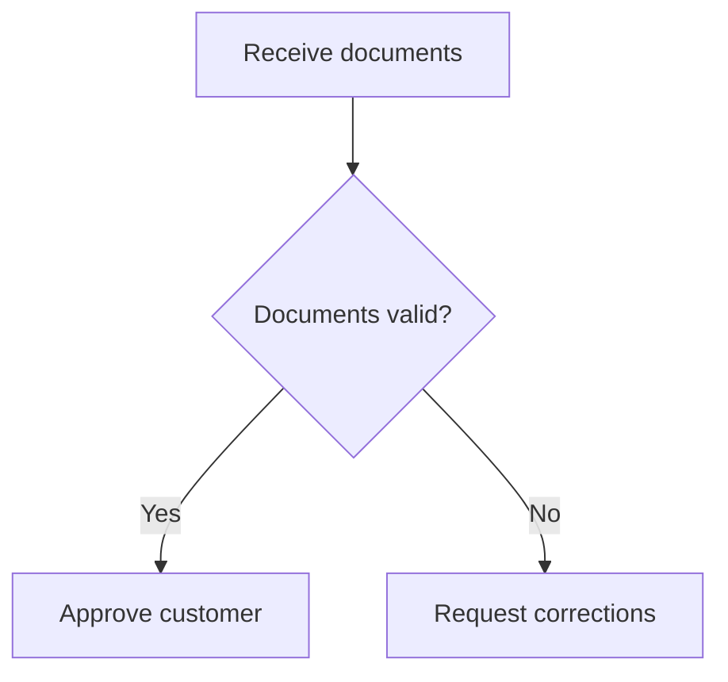
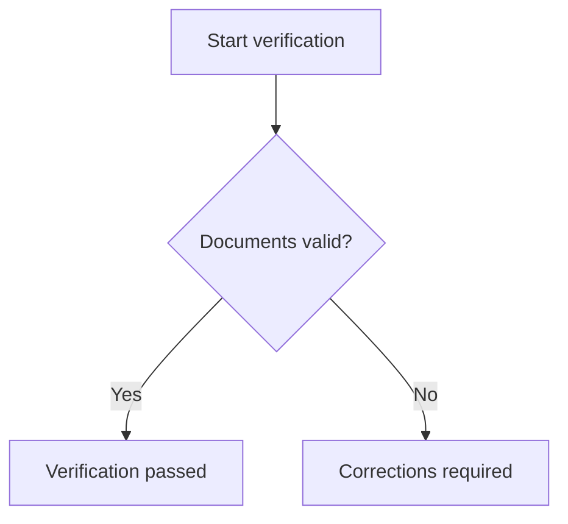
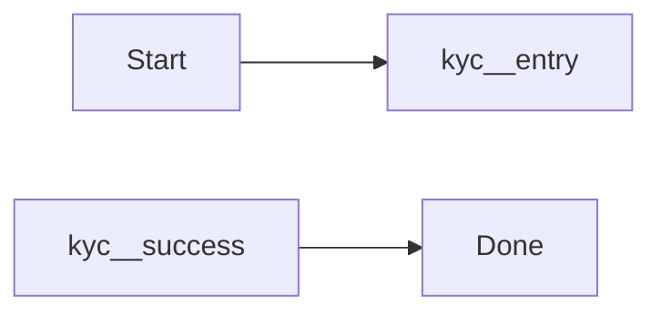
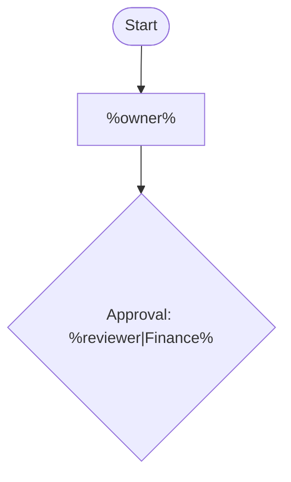
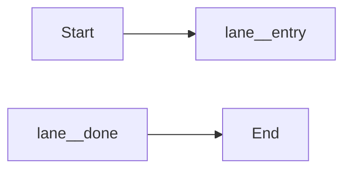

# MDMM Authoring Language Reference

This reference describes the authoring constructs supported by `mdmm`.

## 1. Reusable Diagram Block

Declare a reusable diagram inside HTML comments:

````md
<!-- mermaid:block customer-verification.overview -->

<!-- /mermaid:block -->
````

Use stable, descriptive block ids. A short reference works only if that id is unique across the entire shared library.

## 2. Including A Whole Diagram

Short reference:

````md
```mermaid-include
customer-verification.overview
```
````

Explicit path reference:

````md
```mermaid-include
../shared/customer-verification.md#customer-verification.overview
```
````

After `mdmm build`, the include becomes a normal `mermaid` block in the output.

## 3. Fragment Declaration

Use a fragment when a standard subprocess must be inserted into a larger diagram:

````md
<!-- mermaid:fragment verification exports=entry,success,fail -->

<!-- /mermaid:fragment -->
````

Rules:
- the fragment has named exported nodes through `exports=`;
- the first line with the diagram type is preserved for author readability, but is not inlined into the outer diagram body;
- only exported nodes are intended for external wiring.

## 4. Fragment Include Inside Mermaid

Fragments are included through Mermaid comments:

````md

````

Explicit path variant:

````md

````

Rules:
- `as <alias>` is required;
- internal node ids are rewritten to `<alias>__<node-id>`;
- the alias must be unique inside that Mermaid block.

## 5. Template Arguments

Blocks and fragments may contain placeholders.

Required argument:

```
%owner%
```

Argument with default:

```
%reviewer|Finance%
```

Example reusable block:

````md
<!-- mermaid:block approval.overview -->

<!-- /mermaid:block -->
````

Single-line include call:

````md
```mermaid-include
approval.overview owner="Risk Office" reviewer=Legal
```
````

Multi-line include call:

````md
```mermaid-include
approval.overview
owner = Operations
reviewer = Finance
```
````

Fragment call with arguments:

````md

````

Multi-line fragment include:

````md

````

Template rules:
- unknown arguments are errors;
- missing required arguments are errors;
- repeated definitions of the same argument are errors;
- quote single-line values that contain spaces.

## 6. Nested Template References

A template may include another template or fragment reference through an argument.

````md
<!-- mermaid:block review.wrapper -->

<!-- /mermaid:block -->
````

Call site:

````md
```mermaid-include
review.wrapper fragmentRef=audit reviewer=Legal
```
````

Path resolution rule:
- if a relative path comes from the caller as an argument, resolve it relative to the caller document;
- if a relative path comes from a default value inside the template, resolve it relative to the template file.

## 7. Short Vs Explicit References

Short reference:
- format: `customer-verification.overview`
- lookup: by block id across all Markdown files under `sharedDir`
- requirement: the id must be globally unique in the shared library

Explicit reference:
- format: `../shared/customer-verification.md#customer-verification.overview`
- lookup: direct file path plus block id
- requirement: path is resolved relative to the current document

Use short refs for daily authoring convenience. Use explicit refs when ambiguity must be removed.

## 8. Authoring Recommendations

- keep block ids stable and descriptive;
- keep reusable diagrams in shared library files that are easy to discover;
- design fragment `exports` as a deliberate public contract;
- use template placeholders for labels and configurable text, not structural identifiers;
- prefer whole-diagram reuse first; use fragments only when a subprocess truly must be embedded in a larger diagram.

## 9. Known Constraints

- a reusable diagram block must expand into exactly one `mermaid` block;
- short refs are limited to block ids resolved under `sharedDir`;
- explicit refs always use `path/to/file.md#block-id`;
- fragments expose only exported nodes to the outside world;
- include depth is limited by `--max-include-depth`;
- `check` validates MDMM structure, but not the final rendered Mermaid result.
