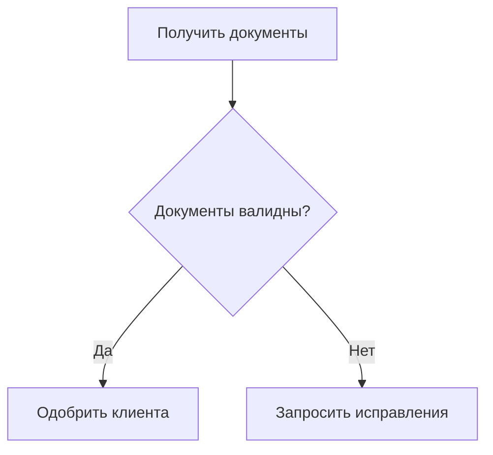
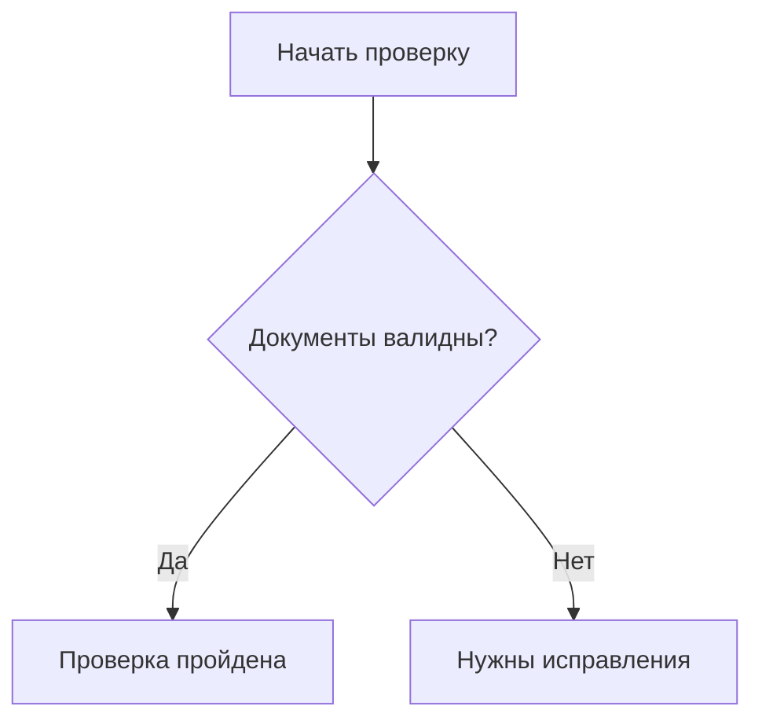
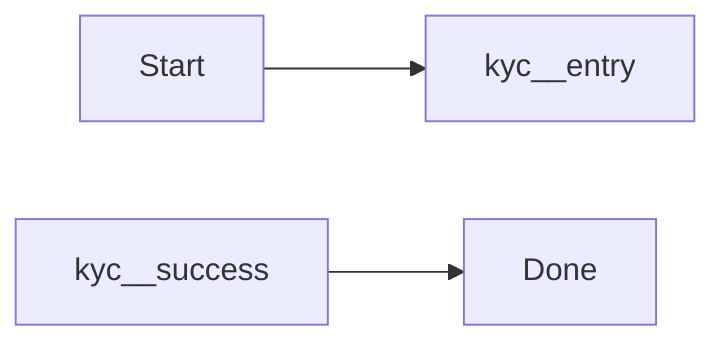
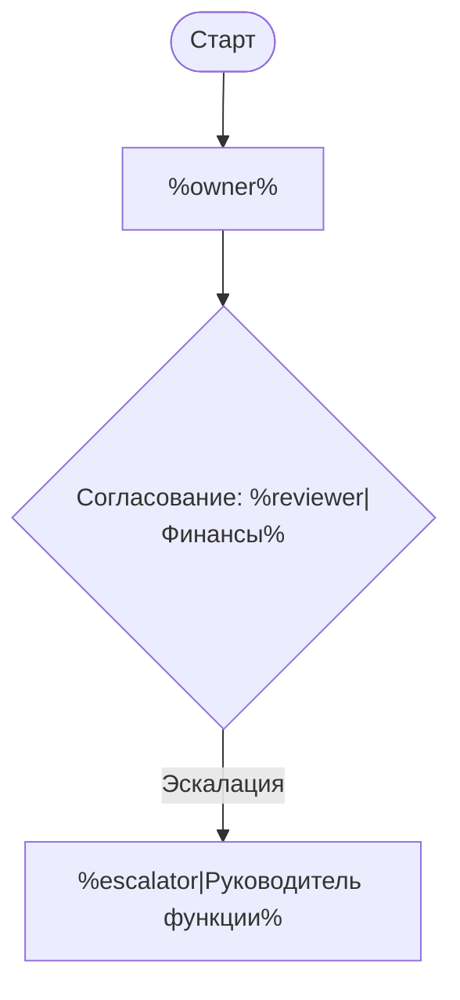
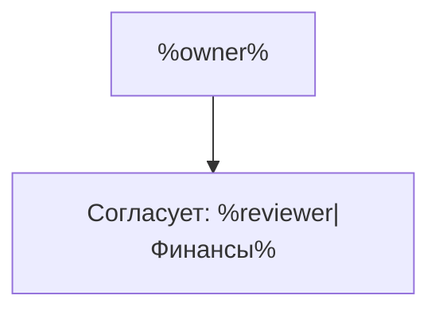
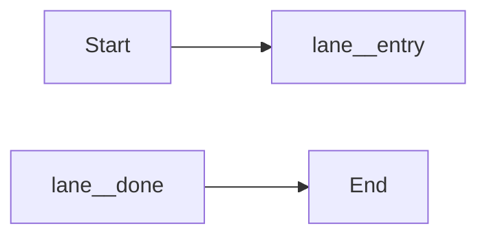

# MDMM: Mermaid Include в Markdown-документации

---

[по-русски](./README.RU.md) | [in english](./README.md)

---

`mdmm` — CLI-инструмент для переиспользования Markdown-секций, Mermaid-диаграмм и Mermaid-фрагментов в Markdown-документах. С его помощью общие блоки можно описать один раз, затем подключать в нужных местах и на выходе получать обычный Markdown с обычными `mermaid`-блоками.

Инструмент построен вокруг простого принципа: автор продолжает работать в привычных `Markdown + Mermaid`, без отдельного DSL, JSON или YAML. `mdmm` добавляет только минимальный синтаксис для подключения общих Markdown-блоков, Mermaid-диаграмм, фрагментов и шаблонов, а проверку ссылок, подстановку аргументов и сборку итогового документа берет на себя.

Это упрощает сопровождение документации: повторяющиеся секции и схемы не копируются вручную, изменения вносятся в одном месте, а результат сборки остается готовым к публикации и понятным любому, кто работает с обычным Markdown.

## Оглавление

- [Быстрый старт](#быстрый-старт)
- [Конфиг проекта](#конфиг-проекта)
- [Рабочий сценарий](#рабочий-сценарий)
- [Внутренний язык MDMM](#внутренний-язык-mdmm):
  - [Объявление переиспользуемой диаграммы](#1-объявление-переиспользуемой-диаграммы)
  - [Вставка целой диаграммы](#2-вставка-целой-диаграммы)
  - [Объявление и вставка Markdown-блока](#3-объявление-и-вставка-markdown-блока)
  - [Объявление и вставка фрагмента](#4-объявление-и-вставка-фрагмента)
  - [Шаблонные аргументы](#5-шаблонные-аргументы)
  - [Вложенные шаблоны и ссылки](#6-вложенные-шаблоны-и-ссылки)
  - [Короткие и явные ссылки](#7-короткие-и-явные-ссылки)
  - [Короткие алиасы](#8-короткие-алиасы)
  - [Рекомендации по авторскому языку](#9-рекомендации-по-авторскому-языку)
- [Команды CLI](#команды-cli)
- [Сводная таблица значений по умолчанию](#сводная-таблица-значений-по-умолчанию)
- [Ограничения текущей версии](#ограничения-текущей-версии)
- [FAQ](#faq)

## Быстрый старт

```bash
npm i -g @bnku/mdmm
mdmm init
```

```bash
npx @bnku/mdmm init
```

После `init` у вас появится базовая структура проекта, пример общей диаграммы и стартовый документ.

## Как это работает

1. Вы храните общие Markdown-блоки, Mermaid-диаграммы и Mermaid-фрагменты в библиотеке.
2. В рабочих документах подключаете их через `mdmm`-директивы.
3. `mdmm check` проверяет ссылки, аргументы шаблонов и правила языка.
4. `mdmm dev` помогает в процессе редактирования и выборочно пересобирает только затронутые документы.
5. `mdmm build` разворачивает все вставки и готовит итоговый Markdown.
6. На выходе остаются обычные `mermaid`-блоки, пригодные для публикации.

## Установка И Запуск

Требование: `Node.js 22` или новее.

| Сценарий | Команда | Когда подходит |
| --- | --- | --- |
| Глобальная установка | `npm i -g @bnku/mdmm` | если вы часто работаете с документацией на этой машине |
| Без установки | `npx @bnku/mdmm ...` | если нужно быстро попробовать инструмент или выполнить разовую сборку |


Примеры:

```bash
npm i -g @bnku/mdmm
mdmm --help
mdmm check
mdmm dev
mdmm build
```

```bash
npx @bnku/mdmm --help
npx @bnku/mdmm init
npx @bnku/mdmm build
```

На npm пакет публикуется как `@bnku/mdmm`, но после установки команда в терминале по-прежнему называется `mdmm`.

В проект также входит агентный скилл в `.agents/mdmm`, который авторы документации могут установить в своего агента, глобально или прямо в свой docs-проект. Он помогает агенту увереннее работать с `mdmm`: понимать ожидаемую структуру проекта, синтаксис переиспользуемых блоков и фрагментов, правильно выбирать между `check`, `dev`, `build` и `report`, а также быстрее разбирать проблемы со ссылками, шаблонными аргументами и include-конструкциями при совместной работе над документацией.

## Новый Проект

Команда `mdmm init` создает новую структуру документационного проекта.

```bash
mdmm init
```

По умолчанию она создает:

```text
.
|- docs/
|  `- index.md
|- shared/
|  `- getting-started.md
|- dist/
`- mdmm.config.json
```

Если файл `mdmm.config.json` или стартовые файлы уже существуют, `init` не будет их перезаписывать без явного флага `--force`.

### Параметры `init`

| Параметр | По умолчанию | Что делает |
| --- | --- | --- |
| `--yes` | выключен | принимает стандартные значения без интерактивных вопросов |
| `--force` | выключен | разрешает перезапись файлов, которые создает `init` |
| `--no-starter` | выключен | создает только структуру каталогов и конфиг, без стартовых Markdown-файлов |

### Поведение `init` по умолчанию

| Что настраивается | Значение по умолчанию |
| --- | --- |
| Каталог документов | `docs/` |
| Каталог общей библиотеки | `shared/` |
| Каталог результата сборки | `dist/` |

Если команда запускается в неинтерактивной среде, используйте `--yes`.

## Конфиг Проекта

`mdmm` может работать вообще без конфига, но для регулярной работы удобнее добавить `mdmm.config.json` в корень проекта.

Пример:

```json
{
  "docsDir": "docs",
  "sharedDir": "shared",
  "outputDir": "dist"
}
```

Все поля необязательны.

### Поля конфига

| Поле | Значение по умолчанию | Что означает |
| --- | --- | --- |
| `docsDir` | `docs` | где лежат исходные Markdown-документы |
| `sharedDir` | `shared` | где лежит библиотека переиспользуемых Markdown- и Mermaid-блоков |
| `outputDir` | `dist` | куда писать результат сборки для каталога |

## Рабочий Сценарий

Обычный поток работы выглядит так:

1. Положите общие Markdown-блоки, диаграммы и фрагменты в `shared/`.
2. Пишите пользовательские документы в `docs/`.
3. Подключайте нужные блоки через `mdmm`-директивы.
4. Запускайте `mdmm check`, чтобы быстро проверить корректность ссылок и шаблонов.
5. Во время редактирования используйте `mdmm dev`, если хотите автоматически обновлять `dist/` только для затронутых документов.
6. Запускайте `mdmm build`, чтобы получить итоговый Markdown для публикации.
7. При необходимости используйте `mdmm report`, чтобы увидеть, где и что переиспользуется.

## Внутренний Язык MDMM

`mdmm` добавляет к обычному Markdown минимальный набор конструкций. Они нужны только для повторного использования Markdown- и Mermaid-контента.

### 1. Объявление переиспользуемой диаграммы

Диаграмма объявляется в HTML-комментариях `mermaid:block`.

````md
<!-- mermaid:block customer-verification.overview -->

<!-- /mermaid:block -->
````

Такой блок потом можно подключать в других документах через `mermaid-include`.

### 2. Вставка целой диаграммы

Самый простой способ подключить общий блок:

````md
```mermaid-include
customer-verification.overview
```
````

Такой вариант называется короткой ссылкой.

Если нужно явно указать файл:

````md
```mermaid-include
../shared/customer-verification.md#customer-verification.overview
```
````

После сборки конструкция `mermaid-include` заменяется обычным `mermaid`-блоком.

### 3. Объявление и вставка Markdown-блока

Markdown-блок нужен, когда вы хотите переиспользовать текст, заголовки, списки или смешанный Markdown-контент.

````md
<!-- markdown:block customer-verification.section -->
## Проверка клиента

Этот раздел остается обычным Markdown.

```mermaid-include
customer-verification.overview
```
<!-- /markdown:block -->
````

Подключение из другого документа:

````md
```markdown-include
customer-verification.section
```
````

После сборки конструкция `markdown-include` заменяется уже собранным Markdown-содержимым.

### 4. Объявление и вставка фрагмента

Фрагмент полезен, когда внутрь одной большой диаграммы нужно вставить типовой подпроцесс.

Фрагмент объявляется отдельной конструкцией `mermaid:fragment`.

````md
<!-- mermaid:fragment verification exports=entry,success,fail -->

<!-- /mermaid:fragment -->
````

Подключение фрагмента внутрь диаграммы:

````md

````

Подключение по явному пути:

````md

````

Что важно знать про фрагменты:

- фрагмент объявляется через `mermaid:fragment ...`;
- у фрагмента обязательно должен быть `alias` через `as ...`;
- имя фрагмента может быть коротким, без суффикса `.fragment`;
- `mdmm` автоматически переписывает внутренние идентификаторы узлов в формат `<alias>__<node-id>`;
- снаружи можно ссылаться только на узлы, перечисленные в `exports`;
- первая строка с типом диаграммы внутри фрагмента сохраняется для автора, но не вставляется внутрь внешней диаграммы.

### 5. Шаблонные аргументы

В Markdown-блоках, диаграммах и фрагментах можно использовать простые параметры.

Пример шаблона:

````md
<!-- mermaid:block approval.overview -->

<!-- /mermaid:block -->
````

Пример шаблонного фрагмента:

````md
<!-- mermaid:fragment approval exports=entry,done -->

<!-- /mermaid:fragment -->
````

### Формы подстановки

| Форма | Что означает | Поведение по умолчанию |
| --- | --- | --- |
| `%name%` | обязательный аргумент | если аргумент не передан, команда завершится ошибкой |
| `%name\|Текст%` | аргумент со значением по умолчанию | если аргумент не передан, будет использован текст после `\|` |

Компактная однострочная форма для диаграммы:

````md
```mermaid-include
approval.overview owner="Риск-офис" reviewer=Юристы
```
````

Многострочная форма для диаграммы:

````md
```mermaid-include
approval.overview
owner = Операционный блок
escalator = Руководитель направления
```
````

Компактная форма для фрагмента:

````md

````

Многострочная форма для фрагмента:

````md

````

Правила шаблонов:

- неизвестный аргумент вызывает ошибку;
- пропущенный обязательный аргумент вызывает ошибку;
- повторное объявление одного и того же аргумента вызывает ошибку;
- значения с пробелами в однострочной форме нужно брать в кавычки.

### 6. Вложенные шаблоны и ссылки

Шаблон может подключать другой шаблон или фрагмент.

Пример:

````md
<!-- mermaid:block review.wrapper -->

<!-- /mermaid:block -->
````

Вызов:

````md
```mermaid-include
review.wrapper fragmentRef=audit reviewer=Юристы
```
````

Вызов с явным путем:

````md
```mermaid-include
review.wrapper fragmentRef=../shared/library.md#audit reviewer=Юристы
```
````

Правило разрешения путей во вложенных шаблонах:

- если относительный путь передан явно как аргумент шаблона, он трактуется относительно документа, который вызывает шаблон;
- если относительный путь указан как значение по умолчанию внутри самого шаблона, он трактуется относительно файла шаблона.

### 7. Короткие и явные ссылки

| Форма ссылки | Пример | Где ищется |
| --- | --- | --- |
| Короткая | `customer-verification.overview` | во всех `.md`-файлах внутри `sharedDir`, рекурсивно, в рамках нужного типа блока |
| Явная | `../shared/customer-verification.md#customer-verification.overview` | путь считается относительно текущего документа |

Короткие ссылки удобнее для повседневной работы. `mdmm` ищет их по `block id` во всем дереве `sharedDir`, но с учетом типа include: `mermaid-include` ищет диаграммы, `markdown-include` ищет Markdown-блоки, а fragment include ищет фрагменты. Это значит, что один и тот же `block id` может существовать по одному разу в каждом типе блока без конфликта коротких ссылок. Явные ссылки полезны, когда нужно однозначно указать конкретный файл.

### 8. Короткие алиасы

Для тех, кто хочет меньше печатать, поддерживаются короткие алиасы:

- `mm:block` вместо `mermaid:block`
- `mm:fragment` вместо `mermaid:fragment`
- `md:block` вместо `markdown:block`
- `mm-include` вместо `mermaid-include`
- `md-include` вместо `markdown-include`

В этом README примеры намеренно оставлены на длинных формах, потому что они понятнее при первом знакомстве. Короткие алиасы работают так же.

### 9. Рекомендации по авторскому языку

- используйте шаблонные параметры в подписях, комментариях и значениях аргументов;
- не используйте `%...%` в идентификаторах узлов, `alias` и строке типа диаграммы;
- давайте блокам стабильные и понятные `block id`;
- для фрагментов заранее продумывайте публичные точки входа и выхода через `exports`.

## Команды CLI

### Общие команды и глобальные опции

Если вызвать `mdmm` без команды, инструмент покажет справку и короткий путь старта.

```bash
mdmm
mdmm --help
mdmm --version
```

У каждой команды есть собственная справка:

```bash
mdmm build --help
mdmm check --help
mdmm dev --help
```

### Глобальные опции

| Опция | По умолчанию | Что делает |
| --- | --- | --- |
| `--help`, `-h` | выключена | показывает общую справку |
| `--version`, `-v` | выключена | показывает установленную версию `mdmm` |
| `--no-color` | выключена | отключает цветной вывод |
| `NO_COLOR` | не задана | если переменная окружения задана, цветной вывод отключается |

Цветной вывод включается автоматически только в терминале, который поддерживает TTY.

## Команда `init`

Синтаксис:

```bash
mdmm init [--yes] [--force] [--no-starter]
```

Что делает команда:

- создает `mdmm.config.json`;
- создает каталоги `docs/`, `shared/`, `dist/`;
- при стандартном поведении добавляет стартовые Markdown-файлы.

### Параметры `init`

| Параметр | По умолчанию | Что делает |
| --- | --- | --- |
| `--yes` | выключен | принимает стандартную структуру проекта без вопросов |
| `--force` | выключен | разрешает перезапись файлов, которые создает `init` |
| `--no-starter` | выключен | не создает `docs/index.md` и `shared/getting-started.md` |

## Команда `check`

Синтаксис:

```bash
mdmm check [<input.md|input-dir>] [--max-include-depth <n>]
```

Когда использовать:

- когда нужно быстро проверить корректность ссылок;
- когда вы редактировали шаблоны или фрагменты;
- когда не нужен итоговый файл, а нужна только проверка.

Что проверяет `check`:

- существование блоков и файлов;
- корректность коротких и явных ссылок;
- корректность `alias` и `exports`;
- обязательные и неизвестные аргументы шаблонов;
- глубину вложенных include.

Что `check` не делает:

- не записывает файлы;
- не выполняет финальную Mermaid-валидацию результата.

### Параметры `check`

| Параметр | По умолчанию | Что делает |
| --- | --- | --- |
| `<input.md|input-dir>` | `docsDir` из конфига или `./docs` | задает файл или каталог для проверки |
| `--max-include-depth <n>` | `5` | ограничивает глубину вложенных include |

Примеры:

```bash
mdmm check
mdmm check ./docs
mdmm check ./docs/customer-flow.md
mdmm check ./docs --max-include-depth 8
```

## Команда `dev`

Синтаксис:

```bash
mdmm dev [<input-dir>] [--output <output-path>] [--max-include-depth <n>] [--no-validate]
```

Когда использовать:

- когда вы активно редактируете документы или общие Mermaid-блоки;
- когда хотите держать `dist/` в актуальном состоянии без ручного запуска `build`;
- когда полный rebuild всего проекта после маленького изменения был бы слишком дорогим.

Что делает `dev`:

- выполняет начальную сборку каталога;
- следит за исходными документами, общей библиотекой и конфигом проекта;
- пересобирает только затронутые Markdown-документы, если меняются зависимости;
- сохраняет на диске последний успешный результат, если очередная сборка падает;
- продолжает работать после ошибки, чтобы следующая правка автоматически запустила новую пересборку.

### Параметры `dev`

| Параметр | По умолчанию | Что делает |
| --- | --- | --- |
| `<input-dir>` | `docsDir` из конфига или `./docs` | задает каталог, за которым нужно следить и который нужно пересобирать |
| `--output <output-path>` | `outputDir` из конфига или `./dist` | задает каталог, куда писать обновленные Markdown-файлы |
| `--max-include-depth <n>` | `5` | ограничивает глубину вложенных include |
| `--no-validate` | выключен | отключает финальную Mermaid-валидацию при пересборках в watch-режиме |

### Важные свойства `dev`

- `dev` пока поддерживает только каталог на входе;
- команда использует граф зависимостей и не пересобирает заведомо не затронутые документы;
- добавление или удаление общих блоков тоже может затронуть документы с короткими ссылками;
- если пересборка падает, предыдущая успешная версия файлов остается на диске.

Примеры:

```bash
mdmm dev
mdmm dev ./docs --output ./dist/docs
mdmm dev ./docs --no-validate
```

## Команда `build`

Синтаксис:

```bash
mdmm build [<input.md|input-dir>] [--output <output-path>] [--max-include-depth <n>] [--no-validate]
```

Когда использовать:

- когда нужен итоговый Markdown для публикации;
- когда нужно развернуть все include в обычные Mermaid-блоки;
- когда важно дополнительно проверить итоговый Mermaid-контент.

Что делает `build`:

- разворачивает Markdown include, diagram include и fragment include;
- подставляет аргументы шаблонов;
- по умолчанию валидирует итоговые Mermaid-блоки;
- записывает результат в файл или каталог;
- для каталога сохраняет относительную структуру файлов.

### Параметры `build`

| Параметр | По умолчанию | Что делает |
| --- | --- | --- |
| `<input.md|input-dir>` | `docsDir` из конфига или `./docs` | задает файл или каталог для сборки |
| `--output <output-path>` | зависит от режима | задает путь записи результата |
| `--max-include-depth <n>` | `5` | ограничивает глубину вложенных include |
| `--no-validate` | выключен | отключает финальную Mermaid-валидацию |

### Поведение `build` по умолчанию

| Сценарий | Поведение |
| --- | --- |
| Сборка одного файла без `--output` | результат печатается в стандартный вывод |
| Сборка одного файла с `--output` | результат записывается в указанный файл |
| Сборка каталога без `--output` | результат записывается в `outputDir` из конфига или в `./dist` |
| Сборка каталога с `--output` | результат записывается в указанный каталог |
| Валидация Mermaid | включена |

### Важные свойства `build`

- если итоговый Mermaid некорректен, команда завершится ошибкой;
- при сборке каталога `mdmm` не записывает частичный результат: сначала проверяет все файлы, потом пишет выходные данные;
- если на вход подан каталог, `mdmm` обрабатывает все `.md`-файлы рекурсивно;
- если рекурсивно обрабатывается корень проекта, каталоги общей библиотеки и результата сборки пропускаются автоматически.

Примеры:

```bash
mdmm build
mdmm build ./docs --output ./dist/docs
mdmm build ./docs/customer-flow.md
mdmm build ./docs/customer-flow.md --output ./dist/customer-flow.md
mdmm build ./docs --no-validate
```

## Команда `report`

Синтаксис:

```bash
mdmm report [<input.md|input-dir>] [--output <report.json>]
```

Когда использовать:

- когда нужно понять, какие общие блоки где используются;
- когда вы чистите общую библиотеку блоков;
- когда нужно оценить влияние изменений в общем блоке.

Что попадает в отчет:

- список обработанных Markdown-файлов;
- зависимости каждого файла;
- тип зависимости: `markdown`, `diagram` или `fragment`;
- исходная ссылка автора;
- целевой файл и `block id`;
- `alias` для fragment include;
- переданные аргументы шаблонов;
- сводка по использованию блоков.

### Параметры `report`

| Параметр | По умолчанию | Что делает |
| --- | --- | --- |
| `<input.md|input-dir>` | `docsDir` из конфига или `./docs` | задает файл или каталог для отчета |
| `--output <report.json>` | стандартный вывод | записывает JSON-отчет в файл |

Примеры:

```bash
mdmm report
mdmm report ./docs --output ./dist/dependencies.json
mdmm report ./docs/customer-flow.md
```

## Команда `adopt`

Синтаксис:

```bash
mdmm adopt
```

Команда уже зарезервирована в CLI, но пока не выполняет автоматическую миграцию существующего проекта. Сейчас она выводит справочную подсказку и ничего не меняет в файлах.

Эта команда нужна для будущего сценария, когда в уже существующем наборе документов нужно будет найти повторяющиеся диаграммы и аккуратно подготовить проект к внедрению `mdmm`.

## Сводная Таблица Значений По Умолчанию

| Область | Параметр | Значение по умолчанию |
| --- | --- | --- |
| Конфиг проекта | `docsDir` | `docs` |
| Конфиг проекта | `sharedDir` | `shared` |
| Конфиг проекта | `outputDir` | `dist` |
| `init` | режим | интерактивный |
| `init` | стартовые файлы | создаются |
| `check` | входной путь | `docsDir` из конфига или `./docs` |
| `check` | `--max-include-depth` | `5` |
| `dev` | входной путь | `docsDir` из конфига или `./docs` |
| `dev` | вывод без `--output` | `outputDir` из конфига или `./dist` |
| `dev` | `--max-include-depth` | `5` |
| `dev` | Mermaid-валидация | включена |
| `build` | входной путь | `docsDir` из конфига или `./docs` |
| `build` | `--max-include-depth` | `5` |
| `build` | Mermaid-валидация | включена |
| `build` | вывод для одного файла без `--output` | стандартный вывод |
| `build` | вывод для каталога без `--output` | `outputDir` из конфига или `./dist` |
| `report` | входной путь | `docsDir` из конфига или `./docs` |
| `report` | вывод без `--output` | стандартный вывод |
| Цветной вывод | `--no-color` | выключен |
| Цветной вывод | `NO_COLOR` | не задана |

## Ограничения Текущей Версии

- переиспользуемый блок диаграммы должен в итоге разворачиваться ровно в один `mermaid`-блок;
- короткая ссылка разрешается по `block id` в рамках типа блока во всех Markdown-файлах внутри `sharedDir`, рекурсивно;
- явная ссылка всегда записывается в форме `path/to/file.md#block-id`;
- фрагменты разрешают внешние ссылки только на узлы из `exports`;
- `alias` внутри одного `mermaid`-блока должен быть уникальным;
- шаблонные параметры не предназначены для `node id`, `alias` и строки типа диаграммы;
- глубина вложенности ограничивается параметром `--max-include-depth`;
- `check` может пройти успешно, а `build` завершиться ошибкой, если итоговый Mermaid оказывается некорректным;
- `dev` пока поддерживает только каталог, а не watch-режим для одного файла;
- `adopt` пока не выполняет реальную миграцию.

## FAQ

**Нужен ли `mdmm.config.json`?**

Нет. Инструмент умеет работать и без конфига. Но для постоянной работы с проектом конфиг удобнее, потому что в нем один раз задаются каталоги документов, общей библиотеки и результата сборки.

**Можно ли запускать `mdmm` на одном файле?**

`check`, `build` и `report` принимают как отдельный `.md`-файл, так и каталог. `dev` пока следит только за каталогом.

**Куда `mdmm` ищет короткие ссылки?**

Только в `sharedDir`. Поиск идет с учетом типа блока: `mermaid-include` ищет диаграммы, `markdown-include` ищет Markdown-блоки, а fragment include ищет фрагменты. Если нужно сослаться на конкретный файл, используйте явную ссылку `path/to/file.md#block-id`.

**Почему `build` иногда падает, хотя `check` проходит?**

`check` проверяет правила языка `mdmm`, но не делает финальную Mermaid-валидацию. `build` по умолчанию валидирует уже готовый итоговый Mermaid-контент.

**Что получится на выходе после `build`?**

Обычный Markdown, где все директивы `mdmm` уже развернуты: переиспользуемый Markdown встроен в документ, а Mermaid остается стандартными `mermaid`-блоками.
