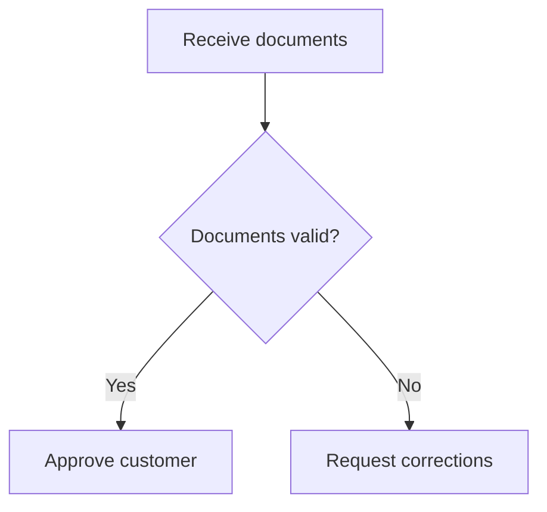
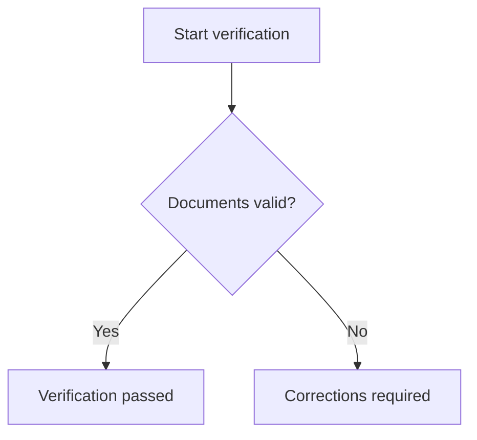
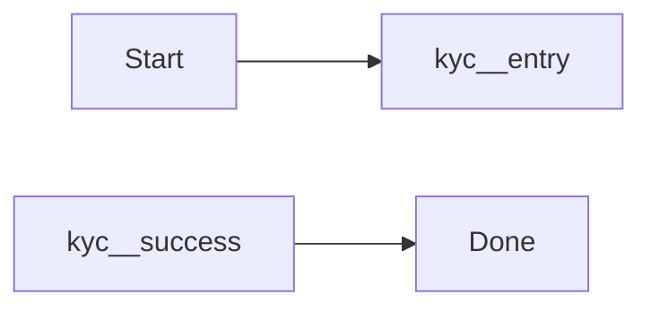
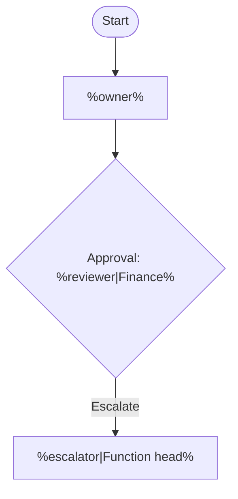
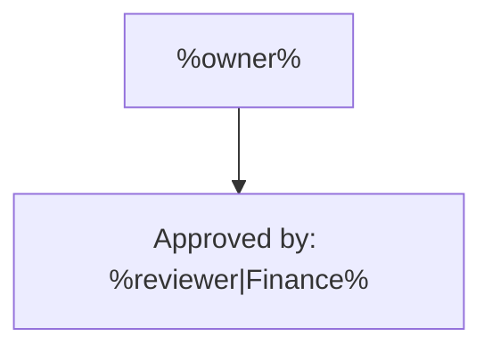
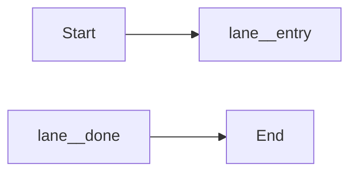

# MDMM: Mermaid Include for Markdown Documentation

---

[по-русски](./README.RU.md) | [in english](./README.md)

---


`mdmm` is a CLI tool for reusing Markdown sections, Mermaid diagrams, and Mermaid fragments in Markdown documents. It lets you define shared blocks once, include them where needed, and generate plain Markdown with standard `mermaid` blocks as output.

The tool follows a simple idea: authors keep working in familiar `Markdown + Mermaid`, without a separate DSL, JSON, or YAML. `mdmm` only adds a minimal syntax for including shared Markdown blocks, diagrams, fragments, and templates, while handling reference validation, argument substitution, and final document assembly.

This makes documentation easier to maintain: repeated sections and diagrams do not need to be copied by hand, updates happen in one place, and the final output stays ready for publication and easy to read for anyone working with plain Markdown.

## Table Of Contents

- [Quick Start](#quick-start)
- [How It Works](#how-it-works)
- [Installation And Usage](#installation-and-usage)
- [New Project](#new-project)
- [Project Config](#project-config)
- [Workflow](#workflow)
- [The MDMM Authoring Language](#the-mdmm-authoring-language)
  - [Declaring A Reusable Diagram](#1-declaring-a-reusable-diagram)
  - [Including A Diagram](#2-including-a-diagram)
  - [Declaring And Including A Markdown Block](#3-declaring-and-including-a-markdown-block)
  - [Declaring And Including A Fragment](#4-declaring-and-including-a-fragment)
  - [Template Arguments](#5-template-arguments)
  - [Nested Templates And References](#6-nested-templates-and-references)
  - [Short And Explicit References](#7-short-and-explicit-references)
  - [Short Aliases](#8-short-aliases)
  - [Authoring Recommendations](#9-authoring-recommendations)
- [CLI Commands](#cli-commands)
- [Default Values Summary](#default-values-summary)
- [Current Limitations](#current-limitations)
- [FAQ](#faq)

## Quick Start

```bash
npm i -g @bnku/mdmm
mdmm init
```

```bash
npx @bnku/mdmm init
```

After `init`, you get a basic project structure, a sample shared diagram, and a starter document.

## How It Works

1. Store shared Markdown blocks, Mermaid diagrams, and Mermaid fragments in a library.
2. Include them from working documents through `mdmm` directives.
3. Run `mdmm check` to validate references, template arguments, and language rules.
4. Use `mdmm dev` during authoring when you want watch mode with selective rebuilds.
5. Run `mdmm build` to expand all includes and produce final Markdown.
6. The output contains plain `mermaid` blocks ready for publication.

## Installation And Usage

Requirement: `Node.js 22` or newer.

| Scenario | Command | When it fits |
| --- | --- | --- |
| Global install | `npm i -g @bnku/mdmm` | when you work with documentation on this machine regularly |
| No installation | `npx @bnku/mdmm ...` | when you want to try the tool quickly or run a one-off build |

Examples:

```bash
npm i -g @bnku/mdmm
mdmm --help
mdmm check
mdmm dev
mdmm build
```

```bash
npx @bnku/mdmm --help
npx @bnku/mdmm init
npx @bnku/mdmm build
```

The package is published on npm as `@bnku/mdmm`, but the installed CLI command remains `mdmm`.

This project also ships with an agent skill in `.agents/mdmm` that documentation authors can install into their own agent setup, either globally or inside a docs project. It helps the agent work with `mdmm` more reliably by understanding the expected project layout, the reusable block and fragment syntax, when to use `check`, `dev`, `build`, or `report`, and how to diagnose broken references, template arguments, and include-related issues while collaborating on documentation changes.

## New Project

The `mdmm init` command creates a new documentation project structure.

```bash
mdmm init
```

By default it creates:

```text
.
|- docs/
|  `- index.md
|- shared/
|  `- getting-started.md
|- dist/
`- mdmm.config.json
```

If `mdmm.config.json` or starter files already exist, `init` will not overwrite them unless you pass `--force` explicitly.

### Parameters For `init`

| Parameter | Default | What it does |
| --- | --- | --- |
| `--yes` | off | accepts default values without interactive prompts |
| `--force` | off | allows overwriting files created by `init` |
| `--no-starter` | off | creates only directories and config, without starter Markdown files |

### Default `init` Behavior

| What is configured | Default value |
| --- | --- |
| Documents directory | `docs/` |
| Shared library directory | `shared/` |
| Build output directory | `dist/` |

If the command runs in a non-interactive environment, use `--yes`.

## Project Config

`mdmm` can work without a config file, but for regular use it is more convenient to add `mdmm.config.json` at the project root.

Example:

```json
{
  "docsDir": "docs",
  "sharedDir": "shared",
  "outputDir": "dist"
}
```

All fields are optional.

### Config Fields

| Field | Default value | Meaning |
| --- | --- | --- |
| `docsDir` | `docs` | where source Markdown documents live |
| `sharedDir` | `shared` | where the reusable Markdown and Mermaid library lives |
| `outputDir` | `dist` | where directory build output is written |

## Workflow

A typical workflow looks like this:

1. Put shared Markdown blocks, diagrams, and fragments into `shared/`.
2. Write user-facing documents in `docs/`.
3. Include the blocks you need through `mdmm` directives.
4. Run `mdmm check` for a fast validation of references and templates.
5. Use `mdmm dev` while authoring when you want automatic selective rebuilds into `dist/`.
6. Run `mdmm build` to generate final Markdown for publication.
7. Use `mdmm report` when you need to see what is reused and where.

## The MDMM Authoring Language

`mdmm` adds a minimal set of constructs on top of plain Markdown. They exist only to support reusable Markdown and Mermaid content.

### 1. Declaring A Reusable Diagram

A reusable diagram is declared with `mermaid:block` HTML comments.

````md
<!-- mermaid:block customer-verification.overview -->

<!-- /mermaid:block -->
````

That block can later be included from other documents through `mermaid-include`.

### 2. Including A Diagram

The simplest way to include a shared block is:

````md
```mermaid-include
customer-verification.overview
```
````

This form is called a short reference.

If you want to point to a specific file explicitly:

````md
```mermaid-include
../shared/customer-verification.md#customer-verification.overview
```
````

After the build, the `mermaid-include` block is replaced with a standard `mermaid` block.

### 3. Declaring And Including A Markdown Block

Use a Markdown block when you want to reuse prose, headings, lists, or mixed Markdown content.

````md
<!-- markdown:block customer-verification.section -->
## Customer verification

This section stays in plain Markdown.

```mermaid-include
customer-verification.overview
```
<!-- /markdown:block -->
````

Including it from another document:

````md
```markdown-include
customer-verification.section
```
````

After the build, the `markdown-include` block is replaced with the rendered Markdown content.

### 4. Declaring And Including A Fragment

A fragment is useful when you need to insert a standard subprocess into a larger diagram.

A fragment is declared with a dedicated `mermaid:fragment` construct.

````md
<!-- mermaid:fragment verification exports=entry,success,fail -->

<!-- /mermaid:fragment -->
````

Including a fragment inside a diagram:

````md

````

Including it by explicit path:

````md

````

Important fragment rules:

- fragments are declared through `mermaid:fragment ...`;
- every fragment include must define an `alias` through `as ...`;
- fragment names can be short and do not need a `.fragment` suffix;
- `mdmm` automatically rewrites internal node ids into `<alias>__<node-id>`;
- from outside, you can reference only the nodes listed in `exports`;
- the first line with the diagram type is kept for the author but is not inserted into the outer diagram.

### 5. Template Arguments

Markdown blocks, diagrams, and fragments can use simple parameters.

Example template:

````md
<!-- mermaid:block approval.overview -->

<!-- /mermaid:block -->
````

Example templated fragment:

````md
<!-- mermaid:fragment approval exports=entry,done -->

<!-- /mermaid:fragment -->
````

### Placeholder Forms

| Form | Meaning | Default behavior |
| --- | --- | --- |
| `%name%` | required argument | if the argument is not passed, the command fails |
| `%name\|Text%` | argument with a default value | if the argument is not passed, the text after `\|` is used |

Compact one-line form for a diagram:

````md
```mermaid-include
approval.overview owner="Risk office" reviewer=Legal
```
````

Multi-line form for a diagram:

````md
```mermaid-include
approval.overview
owner = Operations
escalator = Department head
```
````

Compact form for a fragment:

````md

````

Multi-line form for a fragment:

````md

````

Template rules:

- an unknown argument causes an error;
- a missing required argument causes an error;
- redeclaring the same argument causes an error;
- in one-line form, values with spaces must be quoted.

### 6. Nested Templates And References

A template can include another template or fragment.

Example:

````md
<!-- mermaid:block review.wrapper -->

<!-- /mermaid:block -->
````

Call site:

````md
```mermaid-include
review.wrapper fragmentRef=audit reviewer=Legal
```
````

Call site with an explicit path:

````md
```mermaid-include
review.wrapper fragmentRef=../shared/library.md#audit reviewer=Legal
```
````

Path resolution rules in nested templates:

- if a relative path is passed explicitly as a template argument, it is resolved relative to the document that calls the template;
- if a relative path is defined as a default value inside the template itself, it is resolved relative to the template file.

### 7. Short And Explicit References

| Reference form | Example | Where it is resolved |
| --- | --- | --- |
| Short | `customer-verification.overview` | across all `.md` files inside `sharedDir`, recursively, within the requested block type |
| Explicit | `../shared/customer-verification.md#customer-verification.overview` | the path is resolved relative to the current document |

Short references are more convenient for daily work. `mdmm` resolves them by `block id` across the entire `sharedDir` tree, but it scopes the lookup by the include kind: `mermaid-include` looks for reusable diagrams, `markdown-include` looks for reusable Markdown blocks, and fragment includes look for reusable fragments. That means the same `block id` can exist once per block type without creating a short-ref conflict. Explicit references are useful when you need to point to a specific file unambiguously.

### 8. Short Aliases

Short aliases are supported for authors who prefer less typing:

- `mm:block` for `mermaid:block`
- `mm:fragment` for `mermaid:fragment`
- `md:block` for `markdown:block`
- `mm-include` for `mermaid-include`
- `md-include` for `markdown-include`

The examples in this README intentionally use the long forms because they are clearer for first-time readers. The short aliases behave the same way.

### 9. Authoring Recommendations

- use template arguments in labels, comments, and argument values;
- do not use `%...%` in node ids, `alias`, or the diagram type line;
- give blocks stable and readable `block id` values;
- for fragments, think through the public entry and exit points exposed through `exports`.

## CLI Commands

### General Commands And Global Options

If you run `mdmm` without a command, it prints help and a short quick-start message.

```bash
mdmm
mdmm --help
mdmm --version
```

Every command also has its own help:

```bash
mdmm build --help
mdmm check --help
mdmm dev --help
```

### Global Options

| Option | Default | What it does |
| --- | --- | --- |
| `--help`, `-h` | off | shows general help |
| `--version`, `-v` | off | shows the installed `mdmm` version |
| `--no-color` | off | disables colored output |
| `NO_COLOR` | unset | if this environment variable is set, colored output is disabled |

Colored output is enabled automatically only in terminals with TTY support.

## Command `init`

Syntax:

```bash
mdmm init [--yes] [--force] [--no-starter]
```

What the command does:

- creates `mdmm.config.json`;
- creates `docs/`, `shared/`, and `dist/` directories;
- in the default mode, adds starter Markdown files.

### Parameters For `init`

| Parameter | Default | What it does |
| --- | --- | --- |
| `--yes` | off | accepts the default project structure without prompts |
| `--force` | off | allows overwriting files created by `init` |
| `--no-starter` | off | does not create `docs/index.md` or `shared/getting-started.md` |

## Command `check`

Syntax:

```bash
mdmm check [<input.md|input-dir>] [--max-include-depth <n>]
```

When to use it:

- when you want a fast validation of references;
- when you edited templates or fragments;
- when you do not need output files yet and only want validation.

What `check` validates:

- that blocks and files exist;
- that short and explicit references are valid;
- that `alias` and `exports` are valid;
- that required and unknown template arguments are handled correctly;
- include nesting depth.

What `check` does not do:

- it does not write files;
- it does not run final Mermaid validation on the rendered output.

### Parameters For `check`

| Parameter | Default | What it does |
| --- | --- | --- |
| `<input.md|input-dir>` | `docsDir` from config or `./docs` | sets the file or directory to validate |
| `--max-include-depth <n>` | `5` | limits nested include depth |

Examples:

```bash
mdmm check
mdmm check ./docs
mdmm check ./docs/customer-flow.md
mdmm check ./docs --max-include-depth 8
```

## Command `dev`

Syntax:

```bash
mdmm dev [<input-dir>] [--output <output-path>] [--max-include-depth <n>] [--no-validate]
```

When to use it:

- when you are actively editing docs or shared Mermaid blocks;
- when you want `dist/` to stay up to date without rerunning `build` by hand;
- when full project rebuilds would be unnecessarily expensive after a small change.

What `dev` does:

- performs an initial directory build;
- watches source docs, the shared library, and project config;
- rebuilds only the affected Markdown documents when dependencies change;
- keeps the last successful output if an updated batch fails;
- keeps watching after errors so the next fix can rebuild automatically.

### Parameters For `dev`

| Parameter | Default | What it does |
| --- | --- | --- |
| `<input-dir>` | `docsDir` from config or `./docs` | sets the directory to watch and rebuild |
| `--output <output-path>` | `outputDir` from config or `./dist` | sets where rebuilt Markdown files are written |
| `--max-include-depth <n>` | `5` | limits nested include depth |
| `--no-validate` | off | disables final Mermaid validation during watch rebuilds |

### Important `dev` Properties

- `dev` currently watches a directory input only;
- it uses dependency tracking to avoid rebuilding unrelated docs;
- adding or removing shared blocks can still trigger rebuilds for short-reference users;
- if a rebuild fails, the previous successful file contents stay on disk.

Examples:

```bash
mdmm dev
mdmm dev ./docs --output ./dist/docs
mdmm dev ./docs --no-validate
```

## Command `build`

Syntax:

```bash
mdmm build [<input.md|input-dir>] [--output <output-path>] [--max-include-depth <n>] [--no-validate]
```

When to use it:

- when you need final Markdown for publication;
- when you want all includes expanded into standard Mermaid blocks;
- when you want an additional validation pass on the final Mermaid content.

What `build` does:

- expands Markdown includes, diagram includes, and fragment includes;
- substitutes template arguments;
- validates final Mermaid blocks by default;
- writes the result to a file or directory;
- preserves relative file structure when building a directory.

### Parameters For `build`

| Parameter | Default | What it does |
| --- | --- | --- |
| `<input.md|input-dir>` | `docsDir` from config or `./docs` | sets the file or directory to build |
| `--output <output-path>` | depends on the mode | sets where the result is written |
| `--max-include-depth <n>` | `5` | limits nested include depth |
| `--no-validate` | off | disables final Mermaid validation |

### Default `build` Behavior

| Scenario | Behavior |
| --- | --- |
| Building a single file without `--output` | prints the result to stdout |
| Building a single file with `--output` | writes the result to the specified file |
| Building a directory without `--output` | writes the result to `outputDir` from config or `./dist` |
| Building a directory with `--output` | writes the result to the specified directory |
| Mermaid validation | enabled |

### Important `build` Properties

- if the final Mermaid output is invalid, the command fails;
- when building a directory, `mdmm` does not write partial output: it validates everything first and writes files only after the full run succeeds;
- if the input is a directory, `mdmm` processes all `.md` files recursively;
- if the recursive input is the project root, the shared library and build output directories are skipped automatically.

Examples:

```bash
mdmm build
mdmm build ./docs --output ./dist/docs
mdmm build ./docs/customer-flow.md
mdmm build ./docs/customer-flow.md --output ./dist/customer-flow.md
mdmm build ./docs --no-validate
```

## Command `report`

Syntax:

```bash
mdmm report [<input.md|input-dir>] [--output <report.json>]
```

When to use it:

- when you want to understand where shared blocks are used;
- when you are cleaning up the shared block library;
- when you need to estimate the impact of changing a shared block.

What the report contains:

- the list of processed Markdown files;
- dependencies for each file;
- dependency type: `markdown`, `diagram`, or `fragment`;
- the original author reference;
- the target file and `block id`;
- the `alias` for fragment includes;
- passed template arguments;
- a block usage summary.

### Parameters For `report`

| Parameter | Default | What it does |
| --- | --- | --- |
| `<input.md|input-dir>` | `docsDir` from config or `./docs` | sets the file or directory for the report |
| `--output <report.json>` | stdout | writes the JSON report to a file |

Examples:

```bash
mdmm report
mdmm report ./docs --output ./dist/dependencies.json
mdmm report ./docs/customer-flow.md
```

## Command `adopt`

Syntax:

```bash
mdmm adopt
```

The command is already reserved in the CLI, but it does not yet perform an automatic migration for an existing project. Right now it prints guidance and does not change any files.

It is intended for a future workflow where an existing documentation set needs repeated diagrams identified and the project prepared carefully for `mdmm` adoption.

## Default Values Summary

| Area | Parameter | Default value |
| --- | --- | --- |
| Project config | `docsDir` | `docs` |
| Project config | `sharedDir` | `shared` |
| Project config | `outputDir` | `dist` |
| `init` | mode | interactive |
| `init` | starter files | created |
| `check` | input path | `docsDir` from config or `./docs` |
| `check` | `--max-include-depth` | `5` |
| `dev` | input path | `docsDir` from config or `./docs` |
| `dev` | output without `--output` | `outputDir` from config or `./dist` |
| `dev` | `--max-include-depth` | `5` |
| `dev` | Mermaid validation | enabled |
| `build` | input path | `docsDir` from config or `./docs` |
| `build` | `--max-include-depth` | `5` |
| `build` | Mermaid validation | enabled |
| `build` | single-file output without `--output` | stdout |
| `build` | directory output without `--output` | `outputDir` from config or `./dist` |
| `report` | input path | `docsDir` from config or `./docs` |
| `report` | output without `--output` | stdout |
| Colored output | `--no-color` | off |
| Colored output | `NO_COLOR` | unset |

## Current Limitations

- a reusable diagram block must ultimately expand into exactly one `mermaid` block;
- a short reference is resolved by `block id` within its block type across all Markdown files inside `sharedDir`, recursively;
- an explicit reference must always use the `path/to/file.md#block-id` form;
- fragments allow external references only to nodes listed in `exports`;
- `alias` must be unique within a single `mermaid` block;
- template arguments are not meant for node ids, `alias`, or the diagram type line;
- nesting depth is limited by `--max-include-depth`;
- `check` can succeed while `build` fails if the final Mermaid output is invalid;
- `dev` currently supports only directory input, not single-file watch mode;
- `adopt` does not yet perform a real migration.

## FAQ

**Do I need `mdmm.config.json`?**

No. The tool can work without a config file. But for regular project work, the config is more convenient because it defines the document, shared-library, and output directories once.

**Can I run `mdmm` on a single file?**

`check`, `build`, and `report` accept either a single `.md` file or a directory. `dev` currently watches a directory only.

**Where does `mdmm` look for short references?**

Only inside `sharedDir`. The lookup is scoped by block type: `mermaid-include` resolves diagram blocks, `markdown-include` resolves Markdown blocks, and fragment includes resolve fragment blocks. If you need to point to a specific file, use an explicit reference like `path/to/file.md#block-id`.

**Why does `build` sometimes fail even when `check` passes?**

`check` validates `mdmm` language rules, but it does not run final Mermaid validation. By default, `build` validates the fully rendered Mermaid output.

**What do I get after `build`?**

Plain Markdown where all `mdmm` directives have already been expanded, with reusable Markdown content inlined and Mermaid output left as standard `mermaid` blocks.
