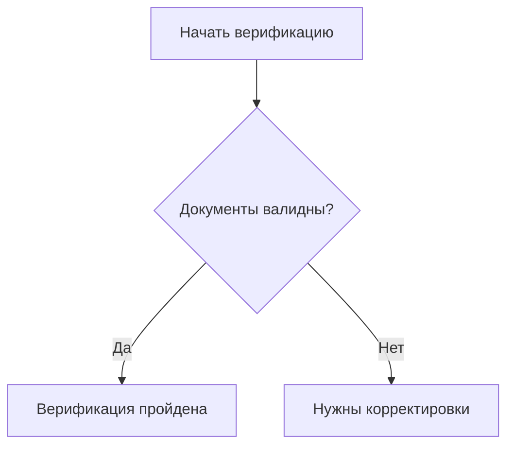
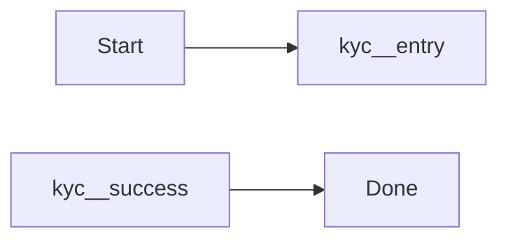
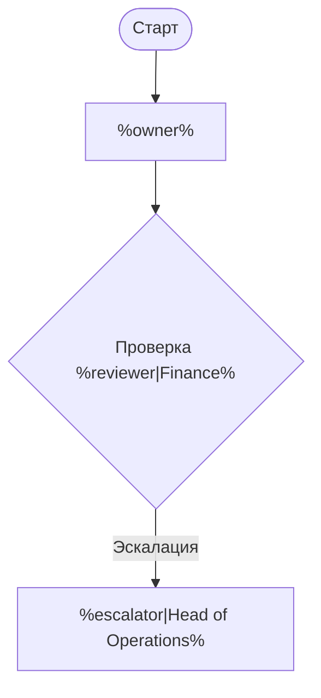
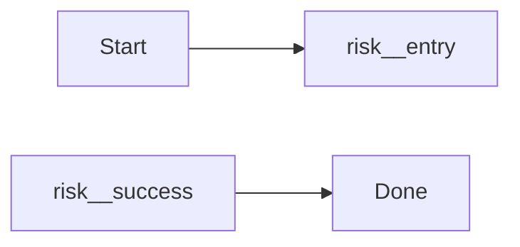
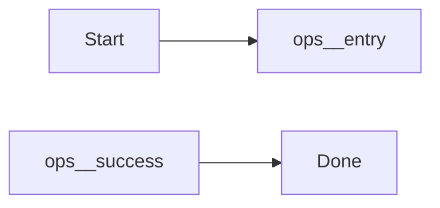
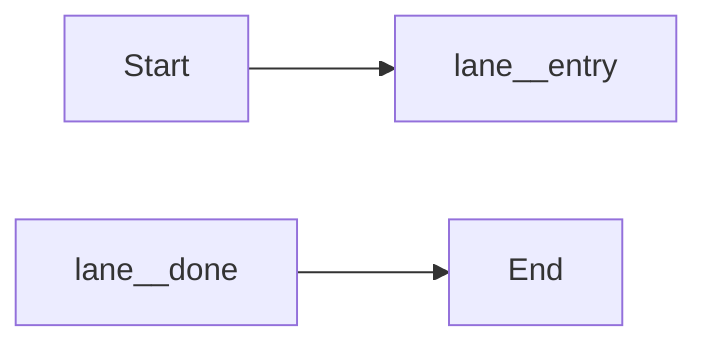

# MDMM

CLI-утилита `mdmm` для переиспользования Mermaid-диаграмм и Mermaid-фрагментов в Markdown-документации.

В этой папке теперь лежат planning-документы и рабочий прототип обоих этапов: include целых Mermaid-диаграмм и include Mermaid-фрагментов внутри большой диаграммы.

## Что уже есть

- `./src/cli.js` — CLI с командами `build` и `check` для файлов и каталогов.
- `./bin/mdmm.js` — publishable entrypoint для локального запуска и будущего `npx`.
- `./src/preprocess.js` — ядро препроцессора.
- `./src/report.js` — сбор dependency report по include-использованию.
- `./examples/shared/customer-verification.md` — библиотека канонических Mermaid-блоков.
- `./examples/shared/customer-templates.md` — библиотека шаблонных Mermaid-блоков и фрагментов.
- `./examples/mdmm.config.json` — пример project-config для docs/shared/output директорий.
- `./examples/docs/whole-include.md` — обычный whole-diagram include: short refs и explicit refs.
- `./examples/docs/fragment-include.md` — обычный fragment include: short refs и explicit refs.
- `./examples/docs/template-whole.md` — whole-diagram templates: one-line args, multiline args и explicit refs.
- `./examples/docs/template-fragment.md` — fragment templates: one-line args, multiline args и explicit refs.
- `./examples/docs/template-nested.md` — nested forwarding через `fragmentRef` с short и explicit path ссылками.
- `./test/preprocess.test.js` — автоматические тесты на позитивные и негативные сценарии.
- `./docs/mdmm/` — planning-пакет по этапам 1 и 2.

## Синтаксис v1

Объявление канонического блока:

````md
<!-- mermaid:block customer-verification.overview -->

<!-- /mermaid:block -->
````

Короткая вставка в произвольный документ:

````md
```mermaid-include
customer-verification.overview
```
````

Явная вставка с принудительным path-based поиском тоже поддерживается:

````md
```mermaid-include
../shared/customer-verification.md#customer-verification.overview
```
````

После сборки кастомный блок заменяется обычным ` ```mermaid `.

## Синтаксис v2

Объявление фрагмента:

````md
<!-- mermaid:block customer-verification.fragment type=fragment exports=entry,success,fail -->

<!-- /mermaid:block -->
````

Вставка внутрь большой диаграммы:

````md

````

Если нужен принудительный path-based поиск, fragment include тоже поддерживает явную форму:

````md

````

Что делает v2:

- author-исходник остается валидным для Mermaid preview, потому что фрагмент оформляется как обычный ` ```mermaid ` блок;
- при include первая строка с типом диаграммы (`flowchart TD`, `sequenceDiagram` и т.д.) удаляется перед встраиванием во внешнюю диаграмму;
- требует `alias` через `as <alias>`;
- переписывает идентификаторы узлов в `<alias>__<node-id>`;
- разрешает снаружи ссылаться только на узлы из `exports`.

## Синтаксис v3

Теперь block и fragment include поддерживают простые шаблонные аргументы.

Placeholder внутри Mermaid:

````md
<!-- mermaid:block customer-verification.overview -->

<!-- /mermaid:block -->
````

- `%name%` — обязательный аргумент;
- `%name|Default value%` — аргумент с дефолтом.

Whole-diagram include, compact one-line form:

````md
```mermaid-include
customer-verification.overview owner="Risk Ops" reviewer=Legal
```
````

Значения с пробелами в compact one-line форме нужно брать в кавычки.

Whole-diagram include, multiline form:

````md
```mermaid-include
customer-verification.overview
owner = Sales Ops
escalator = Head of Operations
```
````

Fragment include, compact one-line form:

````md

````

Fragment include, multiline Mermaid-comment form:

````md

````

Nested forwarding тоже поддерживается. Можно параметризовать и сам nested ref:

````md
<!-- mermaid:block review.wrapper -->

<!-- /mermaid:block -->
````

А затем вызвать его так:

````md
```mermaid-include
review.wrapper fragmentRef=audit.fragment reviewer=Legal
```
````

Explicit path в `fragmentRef` тоже поддерживается:

````md
```mermaid-include
review.wrapper fragmentRef=./library.md#audit.fragment reviewer=Legal
```
````

Важно: если `fragmentRef` содержит `path#block-id`, этот path потом резолвится относительно файла, где объявлен вложенный `%% include`, а не относительно документа, который вызывает внешний шаблон.

Правила v3:

- неизвестный аргумент вызывает ошибку;
- пропущенный обязательный аргумент вызывает ошибку;
- повторное объявление одного и того же аргумента вызывает ошибку;
- при nested forwarding override-блок тоже должен принимать forwarded args по тем же именам;
- `report` сохраняет переданные `args` для whole и fragment include.

Рекомендации по authoring:

- используйте placeholder только в label text, edge labels, Mermaid comments и значениях include-аргументов;
- не используйте `%...%` в `node id`, alias и строке типа диаграммы вроде `flowchart TD`;
- для namespace fragment-узлов продолжайте использовать `as <alias>`, а не шаблонный `prefix`.

## Команды

- `npm test` — запускает unit-тесты.
- `npm run check:examples` — рекурсивно проверяет весь каталог `./examples` с учетом конфига.
- `npm run build:examples` — рекурсивно собирает весь каталог `./examples` в `./examples/dist` с учетом конфига.
- `npm run validate:examples` — валидирует все feature-based примеры, включая шаблонные.
- `npm run report:examples` — записывает JSON usage-map в `./examples/dist/dependencies.json`.
- `npm run smoke:bin` — проверяет publishable CLI entrypoint.
- `npm run pack:dry-run` — показывает, что именно попадет в npm-пакет.

## CLI Usage

Локально из репозитория:

```bash
./bin/mdmm.js --help
./bin/mdmm.js build ./examples
./bin/mdmm.js check
./bin/mdmm.js report ./examples --output ./examples/dist/dependencies.json
```

После публикации пакет будет запускаться как обычная CLI-утилита:

```bash
npx mdmm --help
npx mdmm build
npx mdmm build ./docs --output ./dist/docs
```

## Project Config

CLI умеет работать и с отдельным `.md`, и с каталогом, и полностью "из коробки" от текущего `cwd`.

Если рядом есть `mdmm.config.json`, CLI автоматически подхватит структуру проекта:

```json
{
  "docsDir": "docs",
  "sharedDir": "shared",
  "outputDir": "dist"
}
```

Все поля опциональны. Если конфига нет или какое-то поле пропущено, используются дефолты от текущего `cwd`.

| Key | Default | Meaning |
| --- | --- | --- |
| `docsDir` | `docs` | где лежат исходные Markdown-документы |
| `sharedDir` | `shared` | где искать short refs по `blockId` |
| `outputDir` | `dist` | куда писать собранные документы при directory build |

- конфиг автоматически ищется от входного пути вверх;
- short refs ищутся только в `sharedDir`;
- при `build`, `check` и `report` без positional args CLI берет `docsDir` из конфига или из дефолта `cwd/docs`;
- при `build <dir>` без `--output` CLI пишет в `outputDir`;
- `sharedDir` и `outputDir` автоматически пропускаются при рекурсивной обработке root-каталога.

Примеры:

```bash
./bin/mdmm.js check
./bin/mdmm.js build
./bin/mdmm.js check ./examples
./bin/mdmm.js build ./examples
```

Если на вход подан каталог, CLI рекурсивно обрабатывает все `.md`-файлы и сохраняет относительные пути в выходном каталоге. Поэтому при сборке `./examples` файлы попадают в `./examples/dist/docs/...`, а не прямо в `./examples/dist/...`.

## Dependency Report

CLI умеет строить JSON-отчет по использованию include-директив.

Пример:

```bash
./bin/mdmm.js report ./examples --output ./examples/dist/dependencies.json
```

Что попадает в отчет:

- список Markdown-файлов и их зависимостей;
- тип зависимости: `diagram` или `fragment`;
- исходная ссылка автора, `block id`, целевой файл и `alias` для fragment include;
- переданные template `args` для whole и fragment include;
- сводка `block -> usedBy`, чтобы быстро видеть usage-map общей библиотеки.

## Ограничения текущей версии

- Канонический блок в итоге должен разворачиваться ровно в один ` ```mermaid ` fenced block.
- Include может задаваться либо short ref вида `block-id`, либо явной ссылкой `path/to/file.md#block-id`.
- Whole и fragment include поддерживают template args в one-line и multiline форме.
- Глубина вложенных include ограничена параметром `--max-include-depth` и по умолчанию равна `5`.
- Для fragment include поддерживаются только явно экспортированные узлы.
- Alias должен быть уникальным внутри одного ` ```mermaid ` блока.
- Прототип ожидает, что публичные узлы фрагмента явно определены в самом фрагменте.
- `%name%` и `%name|default%` предназначены для label text и include-аргументов, а не для `node id`.

## Planning-документы

- `./docs/mdmm/00-roadmap.md` — общий roadmap по двум этапам.
- `./docs/01-intro-and-architecture.md` — вводный документ с архитектурными решениями и ограничениями.
- `./docs/mdmm/todo/01-whole-diagram-includes.md` — задача на первый этап.
- `./docs/mdmm/todo/02-fragment-includes.md` — задача на второй этап.
