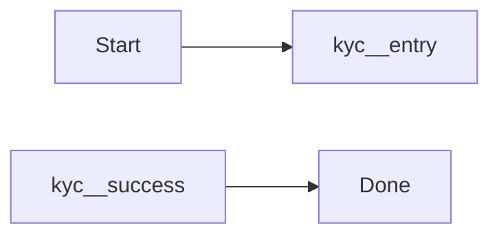

# Mermaid Include Sync

В этой папке теперь лежат planning-документы и рабочий прототип обоих этапов: include целых Mermaid-диаграмм и include Mermaid-фрагментов внутри большой диаграммы.

## Что уже есть

- `./src/cli.js` — CLI с командами `build` и `check` для файлов и каталогов.
- `./src/preprocess.js` — ядро препроцессора.
- `./examples/shared/customer-verification.md` — библиотека канонических Mermaid-блоков.
- `./examples/mermaid-include.config.json` — пример include/exclude-конфига для bulk-сборки.
- `./examples/docs/onboarding.md` — пример include целой диаграммы.
- `./examples/docs/journey.md` — пример include Mermaid-фрагмента внутри диаграммы.
- `./test/preprocess.test.js` — автоматические тесты на позитивные и негативные сценарии.
- `./mermaid-include-sync/` — planning-пакет по этапам 1 и 2.

## Синтаксис v1

Объявление канонического блока:

````md
<!-- mermaid:block customer-verification.overview -->

<!-- /mermaid:block -->
````

Вставка в произвольный документ:

````md
```mermaid-include
../shared/customer-verification.md#customer-verification.overview
```
````

После сборки кастомный блок заменяется обычным ` ```mermaid `.

## Синтаксис v2

Объявление фрагмента:

````md
<!-- mermaid:block customer-verification.fragment type=fragment exports=entry,success,fail -->
```mermaid-fragment
entry[Начать верификацию]
entry --> check{Документы валидны?}
check -- Да --> success[Верификация пройдена]
check -- Нет --> fail[Нужны корректировки]
```
<!-- /mermaid:block -->
````

Вставка внутрь большой диаграммы:

````md

````

Что делает v2:

- требует `alias` через `as <alias>`;
- переписывает идентификаторы узлов в `<alias>__<node-id>`;
- разрешает снаружи ссылаться только на узлы из `exports`.

## Команды

- `npm test` — запускает unit-тесты.
- `npm run check:example` — проверяет пример без записи выходного файла.
- `npm run build:example` — собирает `./examples/docs/onboarding.md` в `./examples/dist/onboarding.md`.
- `npm run validate:example` — прогоняет собранный пример через `mermaid-cli` через `npx`.
- `npm run check:fragment-example` — проверяет fragment include пример.
- `npm run build:fragment-example` — собирает `./examples/docs/journey.md` в `./examples/dist/journey.md`.
- `npm run validate:fragment-example` — валидирует собранный fragment include пример.
- `npm run check:examples` — рекурсивно проверяет весь каталог `./examples` с учетом конфига.
- `npm run build:examples` — рекурсивно собирает весь каталог `./examples` в `./examples/dist` с учетом конфига.
- `npm run validate:examples` — валидирует оба собранных примера.

## Directory Mode

CLI умеет работать не только с отдельным `.md`, но и с каталогом.

Для bulk-сценария можно положить рядом `mermaid-include.config.json`:

```json
{
  "include": ["docs/**/*.md"],
  "exclude": ["dist/**/*.md", "shared/**/*.md"]
}
```

- `include` и `exclude` применяются только в directory mode;
- конфиг автоматически ищется от входного каталога вверх;
- паттерны считаются относительно каталога, где лежит конфиг.

Проверка каталога:

```bash
node ./src/cli.js check ./examples
```

Сборка каталога с сохранением структуры путей:

```bash
node ./src/cli.js build ./examples --output ./examples/dist
```

Если на вход подан каталог, CLI рекурсивно обрабатывает все `.md`-файлы и сохраняет относительные пути в выходном каталоге. Поэтому при сборке `./examples` файлы попадают в `./examples/dist/docs/...`, а не прямо в `./examples/dist/...`.

## Ограничения текущей версии

- Канонический блок в итоге должен разворачиваться ровно в один ` ```mermaid ` fenced block.
- Include по-прежнему задается одной ссылкой вида `path/to/file.md#block-id`.
- Глубина вложенных include ограничена параметром `--max-include-depth` и по умолчанию равна `5`.
- Для fragment include поддерживаются только явно экспортированные узлы.
- Alias должен быть уникальным внутри одного ` ```mermaid ` блока.
- Прототип ожидает, что публичные узлы фрагмента явно определены в самом фрагменте.

## Planning-документы

- `./mermaid-include-sync/00-roadmap.md` — общий roadmap по двум этапам.
- `./mermaid-include-sync/01-intro-and-architecture.md` — вводный документ с архитектурными решениями и ограничениями.
- `./mermaid-include-sync/todo/01-whole-diagram-includes.md` — задача на первый этап.
- `./mermaid-include-sync/todo/02-fragment-includes.md` — задача на второй этап.
