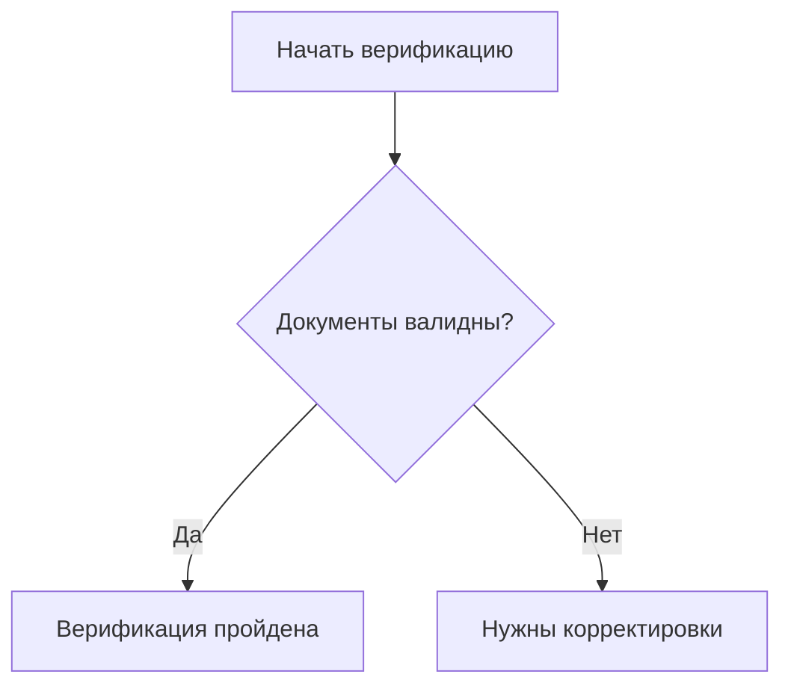
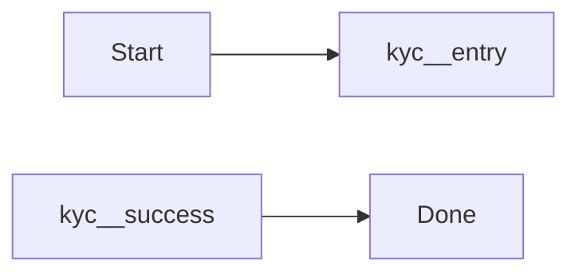

# Mermaid Include Sync

CLI-утилита для переиспользования Mermaid-диаграмм и Mermaid-фрагментов в Markdown-документации.

В этой папке теперь лежат planning-документы и рабочий прототип обоих этапов: include целых Mermaid-диаграмм и include Mermaid-фрагментов внутри большой диаграммы.

## Что уже есть

- `./src/cli.js` — CLI с командами `build` и `check` для файлов и каталогов.
- `./bin/mermaid-include-sync.js` — publishable entrypoint для локального запуска и будущего `npx`.
- `./src/preprocess.js` — ядро препроцессора.
- `./src/report.js` — сбор dependency report по include-использованию.
- `./examples/shared/customer-verification.md` — библиотека канонических Mermaid-блоков.
- `./examples/mermaid-include.config.json` — пример project-config для docs/shared/output директорий.
- `./examples/docs/onboarding.md` — пример include целой диаграммы.
- `./examples/docs/journey.md` — пример include Mermaid-фрагмента внутри диаграммы.
- `./test/preprocess.test.js` — автоматические тесты на позитивные и негативные сценарии.
- `./mermaid-include-sync/` — planning-пакет по этапам 1 и 2.

## Синтаксис v1

Объявление канонического блока:

````md
<!-- mermaid:block customer-verification.overview -->

<!-- /mermaid:block -->
````

Короткая вставка в произвольный документ:

````md
```mermaid-include
customer-verification.overview
```
````

Явная вставка с принудительным path-based поиском тоже поддерживается:

````md
```mermaid-include
../shared/customer-verification.md#customer-verification.overview
```
````

После сборки кастомный блок заменяется обычным ` ```mermaid `.

## Синтаксис v2

Объявление фрагмента:

````md
<!-- mermaid:block customer-verification.fragment type=fragment exports=entry,success,fail -->

<!-- /mermaid:block -->
````

Вставка внутрь большой диаграммы:

````md

````

Если нужен принудительный path-based поиск, fragment include тоже поддерживает явную форму:

````md

````

Что делает v2:

- author-исходник остается валидным для Mermaid preview, потому что фрагмент оформляется как обычный ` ```mermaid ` блок;
- при include первая строка с типом диаграммы (`flowchart TD`, `sequenceDiagram` и т.д.) удаляется перед встраиванием во внешнюю диаграмму;
- требует `alias` через `as <alias>`;
- переписывает идентификаторы узлов в `<alias>__<node-id>`;
- разрешает снаружи ссылаться только на узлы из `exports`.

## Команды

- `npm test` — запускает unit-тесты.
- `npm run check:example` — проверяет пример без записи выходного файла.
- `npm run build:example` — собирает `./examples/docs/onboarding.md` в `./examples/dist/onboarding.md`.
- `npm run validate:example` — прогоняет собранный пример через `mermaid-cli` через `npx`.
- `npm run check:fragment-example` — проверяет fragment include пример.
- `npm run build:fragment-example` — собирает `./examples/docs/journey.md` в `./examples/dist/journey.md`.
- `npm run validate:fragment-example` — валидирует собранный fragment include пример.
- `npm run check:examples` — рекурсивно проверяет весь каталог `./examples` с учетом конфига.
- `npm run build:examples` — рекурсивно собирает весь каталог `./examples` в `./examples/dist` с учетом конфига.
- `npm run validate:examples` — валидирует оба собранных примера.
- `npm run report:examples` — записывает JSON usage-map в `./examples/dist/dependencies.json`.
- `npm run smoke:bin` — проверяет publishable CLI entrypoint.
- `npm run pack:dry-run` — показывает, что именно попадет в npm-пакет.

## CLI Usage

Локально из репозитория:

```bash
./bin/mermaid-include-sync.js --help
./bin/mermaid-include-sync.js build ./examples
./bin/mermaid-include-sync.js check
./bin/mermaid-include-sync.js report ./examples --output ./examples/dist/dependencies.json
```

После публикации пакет будет запускаться как обычная CLI-утилита:

```bash
npx mermaid-include-sync --help
npx mermaid-include-sync build
npx mermaid-include-sync build ./docs --output ./dist/docs
```

## Project Config

CLI умеет работать и с отдельным `.md`, и с каталогом, и полностью "из коробки" от текущего `cwd`.

Если рядом есть `mermaid-include.config.json`, CLI автоматически подхватит структуру проекта:

```json
{
  "docsDir": "docs",
  "sharedDir": "shared",
  "outputDir": "dist"
}
```

Все поля опциональны. Если конфига нет или какое-то поле пропущено, используются дефолты от текущего `cwd`.

| Key | Default | Meaning |
| --- | --- | --- |
| `docsDir` | `docs` | где лежат исходные Markdown-документы |
| `sharedDir` | `shared` | где искать short refs по `blockId` |
| `outputDir` | `dist` | куда писать собранные документы при directory build |

- конфиг автоматически ищется от входного пути вверх;
- short refs ищутся только в `sharedDir`;
- при `build`, `check` и `report` без positional args CLI берет `docsDir` из конфига или из дефолта `cwd/docs`;
- при `build <dir>` без `--output` CLI пишет в `outputDir`;
- `sharedDir` и `outputDir` автоматически пропускаются при рекурсивной обработке root-каталога.

Примеры:

```bash
./bin/mermaid-include-sync.js check
./bin/mermaid-include-sync.js build
./bin/mermaid-include-sync.js check ./examples
./bin/mermaid-include-sync.js build ./examples
```

Если на вход подан каталог, CLI рекурсивно обрабатывает все `.md`-файлы и сохраняет относительные пути в выходном каталоге. Поэтому при сборке `./examples` файлы попадают в `./examples/dist/docs/...`, а не прямо в `./examples/dist/...`.

## Dependency Report

CLI умеет строить JSON-отчет по использованию include-директив.

Пример:

```bash
./bin/mermaid-include-sync.js report ./examples --output ./examples/dist/dependencies.json
```

Что попадает в отчет:

- список Markdown-файлов и их зависимостей;
- тип зависимости: `diagram` или `fragment`;
- исходная ссылка автора, `block id`, целевой файл и `alias` для fragment include;
- сводка `block -> usedBy`, чтобы быстро видеть usage-map общей библиотеки.

## Ограничения текущей версии

- Канонический блок в итоге должен разворачиваться ровно в один ` ```mermaid ` fenced block.
- Include может задаваться либо short ref вида `block-id`, либо явной ссылкой `path/to/file.md#block-id`.
- Глубина вложенных include ограничена параметром `--max-include-depth` и по умолчанию равна `5`.
- Для fragment include поддерживаются только явно экспортированные узлы.
- Alias должен быть уникальным внутри одного ` ```mermaid ` блока.
- Прототип ожидает, что публичные узлы фрагмента явно определены в самом фрагменте.

## Planning-документы

- `./mermaid-include-sync/00-roadmap.md` — общий roadmap по двум этапам.
- `./mermaid-include-sync/01-intro-and-architecture.md` — вводный документ с архитектурными решениями и ограничениями.
- `./mermaid-include-sync/todo/01-whole-diagram-includes.md` — задача на первый этап.
- `./mermaid-include-sync/todo/02-fragment-includes.md` — задача на второй этап.
