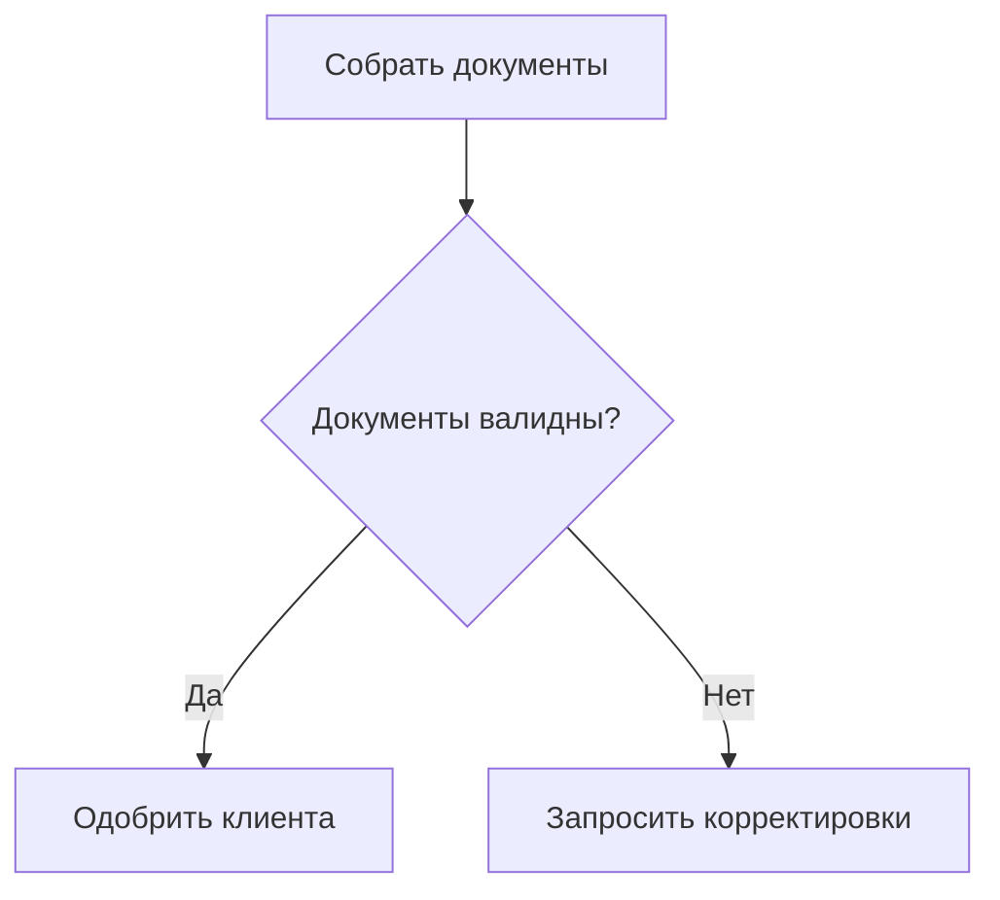
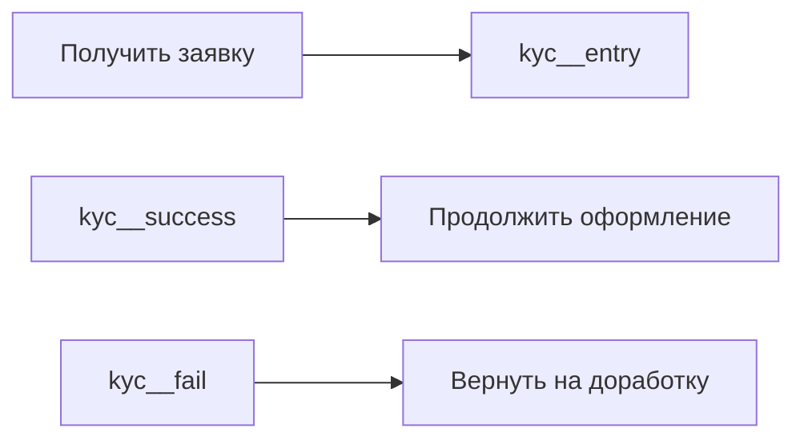

# Вводный документ: подход к синхронизации Mermaid в Markdown

## Зачем нужен этот документ

Этот документ собирает в одном месте рабочую позицию по задаче синхронизации Mermaid-диаграмм в большой Markdown-документации, где авторами выступают не только инженеры, но и аналитики с бизнес-командой.

Цель не в том, чтобы построить сложную инженерную платформу, а в том, чтобы убрать главный источник неконсистентности: ручную копипасту одинаковых диаграмм и фрагментов по десяткам `.md`-файлов.

## Исходная проблема

При росте количества диаграмм до сотен появляется типовая деградация документации:

- один и тот же подпроцесс копируется во множество документов;
- глобальное изменение требует ручных правок в десятках мест;
- часть документов почти неизбежно остается в старом состоянии;
- Mermaid остается валидным синтаксически, но смысл документации становится неконсистентным.

Проблема здесь не в качестве Mermaid как языка, а в отсутствии встроенного `include/import` и в том, что каждая диаграмма трактуется как автономный текстовый блок.

## Почему не стоит начинать с DSL, JSON или model-as-code

С инженерной точки зрения `Structurizr`, `YAML`, `JSON` или отдельный DSL действительно дают более строгий `single source of truth`.

Но в текущем контексте это плохая стартовая точка по трем причинам:

1. Документацией занимаются аналитики и бизнес, а не только инженеры.
2. Диаграмма может быть встроена в произвольный Markdown-документ, а не в централизованный генератор архитектуры.
3. Команда хочет остаться в модели `Markdown + Mermaid`, а не переучиваться на новый способ авторинга.

Из этого следует практическое решение: не менять язык работы команды, а добавить поверх него очень тонкий слой переиспользования.

## Рекомендуемый архитектурный подход

Рекомендованный путь: `MD-first preprocessor`.

Идея простая:

- авторы продолжают писать обычный Markdown;
- диаграммы продолжают жить в Mermaid;
- переиспользуемые блоки объявляются в обычных `.md`-файлах;
- на сборке маленький препроцессор разворачивает include-директивы в обычный Markdown с ` ```mermaid ` блоками.

Это сохраняет привычный authoring flow и при этом переносит ответственность за консистентность на сборочный слой.

## Почему рекомендован поэтапный запуск

Не стоит сразу реализовывать полную композицию Mermaid-фрагментов. Такой старт даст слишком много точек отказа: переписывание node id, экспортируемые узлы, конфликты имен, циклические include и сложная отладка.

Поэтому предлагаются два этапа.

## Этап 1: include целой диаграммы

Первый этап должен решить 80% боли с минимальной сложностью.

### Что именно внедряется

- Канонические Mermaid-блоки хранятся в обычных `.md`-файлах.
- В произвольном Markdown-документе можно сослаться на такой блок через `mermaid-include`.
- На сборке include заменяется обычным ` ```mermaid ` блоком.

### Предлагаемый синтаксис

Объявление канонического блока:

````md
<!-- mermaid:block customer-verification.overview -->

<!-- /mermaid:block -->
````

Вставка в произвольный документ:

````md
```mermaid-include
../shared/customer-verification.md#customer-verification.overview
```
````

### Почему это хороший старт

- почти не меняет поведение авторов документации;
- не требует понимать внутреннюю механику Mermaid;
- поддерживает встраивание диаграммы в любой Markdown-файл;
- хорошо поддается CI-валидации;
- закрывает главный сценарий: один канонический подпроцесс используется во многих местах.

### Ограничение этапа 1

Этот этап не позволяет безопасно собирать одну большую Mermaid-диаграмму из нескольких общих частей. Он решает проблему повторного использования целых диаграмм, но не композиции фрагментов внутри одной схемы.

## Этап 2: include фрагмента внутри Mermaid

Второй этап нужен только если после первого этапа останется реальная потребность собирать большие диаграммы из блоков, а не просто ссылаться на канонические подпроцессы.

### Что именно внедряется

- Отдельный тип блока `mermaid-fragment`.
- Директива include внутри ` ```mermaid ` через Mermaid-комментарий.
- Alias/prefix rewriting для безопасного переименования node id.
- Явные экспортируемые узлы (`exports`) для связывания внешнего графа с фрагментом.

### Предлагаемый синтаксис

Объявление фрагмента:

````md
<!-- mermaid:block customer-verification.fragment type=fragment exports=entry,success,fail -->
```mermaid-fragment
entry[Начать верификацию]
entry --> check{Документы валидны?}
check -- Да --> success[Верификация пройдена]
check -- Нет --> fail[Нужны корректировки]
```
<!-- /mermaid:block -->
````

Вставка во внутренность диаграммы:

````md

````

### Почему это второй этап, а не первый

- появляется сложность с конфликтами идентификаторов;
- нужен формальный контракт между фрагментом и внешней диаграммой;
- ошибки становятся менее очевидными для автора документа;
- растет объем обязательных проверок в CI.

Поэтому этот уровень переиспользования стоит внедрять только после стабилизации базовой модели.

## Ограничения, которые стоит принять сразу

Чтобы решение не превратилось в труднообъяснимый мини-язык, ограничения должны быть частью дизайна, а не последующей доработкой.

### Что стоит запретить или отложить

- include по диапазонам строк;
- неограниченную глубину вложенных include;
- неявные вставки по regex без явных block id;
- автоматическое связывание произвольных узлов без `exports`;
- множественные уровни магии, которые невозможно отладить по исходному Markdown.

### Что стоит зафиксировать как правило

- все переиспользуемые блоки должны иметь стабильный `block id`;
- фрагменты должны иметь `alias` при вставке;
- библиотека общих диаграмм должна храниться в обычных `.md`, а не в технических форматах;
- итоговый output после сборки должен быть обычным валидным Markdown без кастомного синтаксиса.

## Что должно быть в CI

Даже самый хороший синтаксис не решает задачу без проверок.

Минимальный набор валидаций:

- файл include существует;
- `block id` найден;
- нет дублирующихся `block id`;
- нет циклических include;
- после сборки не осталось неразрешенных include-директив;
- итоговые Mermaid-диаграммы проходят `mermaid-cli`.

Расширенный набор для второго этапа:

- `exports` реально существуют в фрагменте;
- ссылки на `alias__export` валидны;
- после префиксации не возникает коллизий node id.

## Что в этом решении главное

Ключевая мысль: нам не нужно синхронизировать независимые Mermaid-файлы между собой. Нам нужно перестать считать их независимыми, если они описывают один и тот же бизнес-смысл.

Отсюда и следует правильная архитектура:

- один канонический блок;
- много мест использования;
- автоматическая подстановка на сборке;
- автоматическая проверка консистентности в CI.

## Итоговая рекомендация

Практический путь внедрения такой:

1. Сначала запустить `include` целых диаграмм.
2. Перенести в канонические блоки наиболее повторяющиеся подпроцессы.
3. Встроить в сборку базовую валидацию и `mermaid-cli`.
4. Посмотреть, сколько кейсов действительно требуют композиции фрагментов.
5. Только потом внедрять fragment-level include с alias и exports.

Это дает реальный эффект уже на первом этапе и не заставляет команду менять способ работы с документацией.
