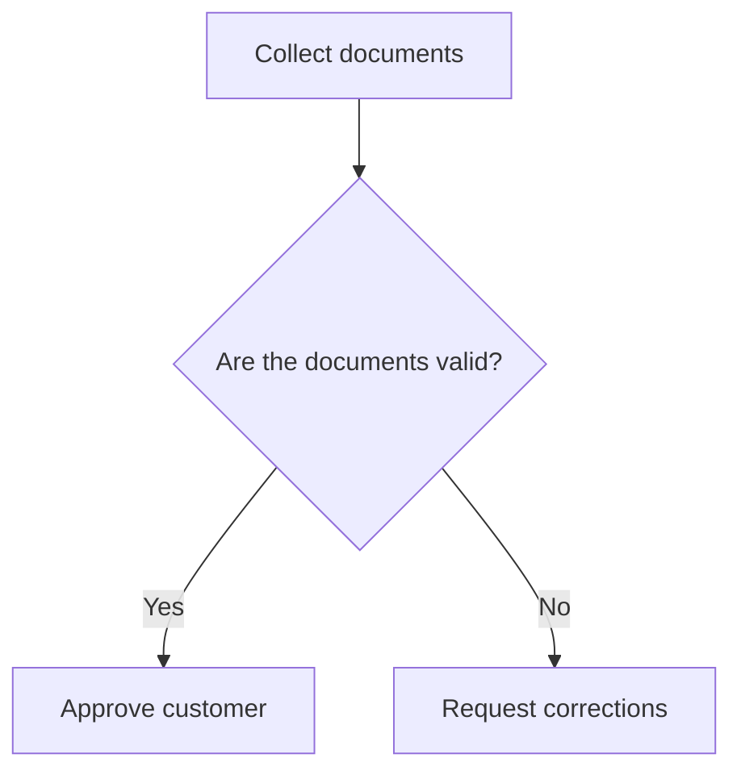
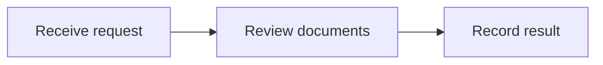

# Diagram Include

Canonical diagram via short ref:

```mermaid
flowchart TD
A[Collect documents] --> B{Are the documents valid?}
B -- Yes --> C[Approve customer]
B -- No --> D[Request corrections]
```

Short subprocess via explicit path ref:

```mermaid
flowchart LR
Start[Receive request] --> Review[Review documents]
Review --> Done[Record result]
```
