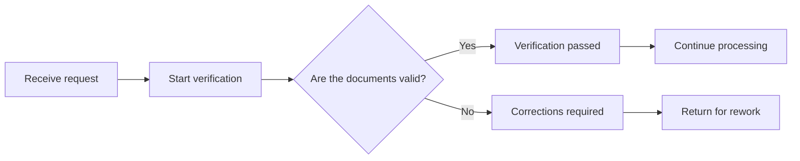

# Fragment Include

Base fragment via short ref:

```mermaid
flowchart LR
Start[Receive request] --> kyc__entry
kyc__entry[Start verification]
kyc__entry --> kyc__check{Are the documents valid?}
kyc__check -- Yes --> kyc__success[Verification passed]
kyc__check -- No --> kyc__fail[Corrections required]
kyc__success --> Offer[Continue processing]
kyc__fail --> Rework[Return for rework]
```

The same base fragment via explicit path ref:

```mermaid
flowchart LR
Start[Receive request] --> explicit__entry
explicit__entry[Start verification]
explicit__entry --> explicit__check{Are the documents valid?}
explicit__check -- Yes --> explicit__success[Verification passed]
explicit__check -- No --> explicit__fail[Corrections required]
explicit__success --> Offer[Continue processing]
explicit__fail --> Rework[Return for rework]
```
