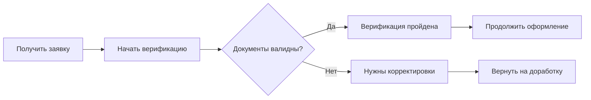

# Fragment Include

Базовый фрагмент по short ref:

```mermaid
flowchart LR
Start[Получить заявку] --> kyc__entry
kyc__entry[Начать верификацию]
kyc__entry --> kyc__check{Документы валидны?}
kyc__check -- Да --> kyc__success[Верификация пройдена]
kyc__check -- Нет --> kyc__fail[Нужны корректировки]
kyc__success --> Offer[Продолжить оформление]
kyc__fail --> Rework[Вернуть на доработку]
```

Тот же базовый фрагмент по explicit path ref:

```mermaid
flowchart LR
Start[Получить заявку] --> explicit__entry
explicit__entry[Начать верификацию]
explicit__entry --> explicit__check{Документы валидны?}
explicit__check -- Да --> explicit__success[Верификация пройдена]
explicit__check -- Нет --> explicit__fail[Нужны корректировки]
explicit__success --> Offer[Продолжить оформление]
explicit__fail --> Rework[Вернуть на доработку]
```
