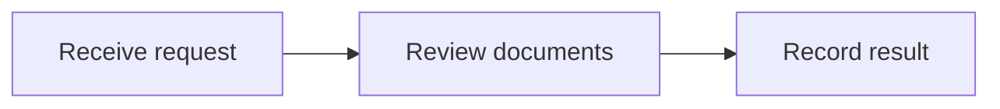
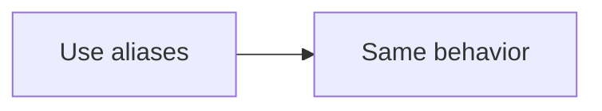

# Markdown Include

Shared Markdown section via short ref:

## Customer Verification

This shared section stays in regular Markdown and can still embed a reusable Mermaid diagram.

Shared Markdown section via explicit path ref:

### Alias-Backed Section

This shared section uses the short declaration and include aliases internally.

