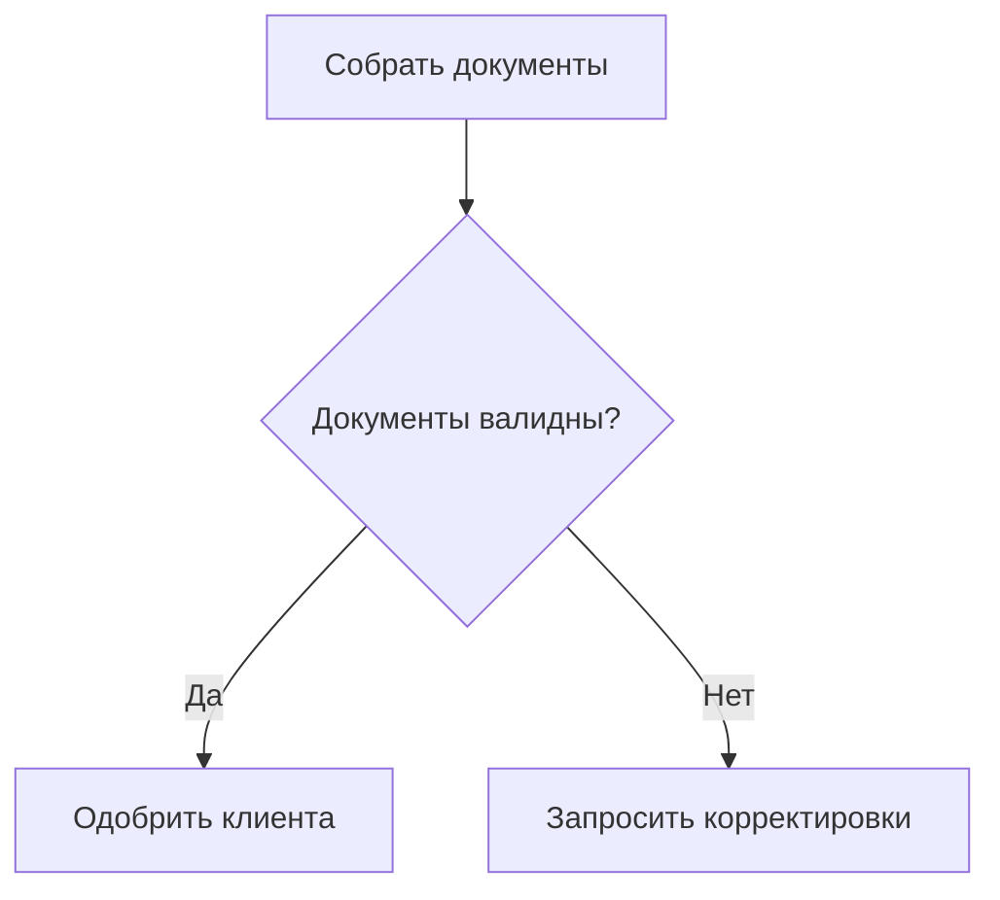
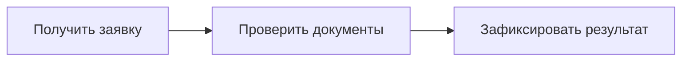

# Онбординг клиента

Ниже используется каноническая диаграмма без копипасты.

```mermaid
flowchart TD
A[Собрать документы] --> B{Документы валидны?}
B -- Да --> C[Одобрить клиента]
B -- Нет --> D[Запросить корректировки]
```

И еще один короткий подпроцесс из той же библиотеки, но с другим форматом импорта.

```mermaid
flowchart LR
Start[Получить заявку] --> Review[Проверить документы]
Review --> Done[Зафиксировать результат]
```
