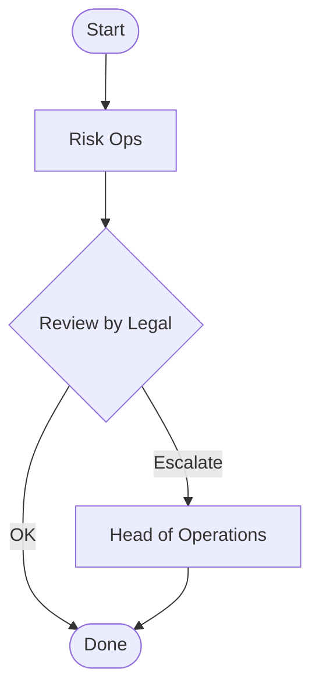
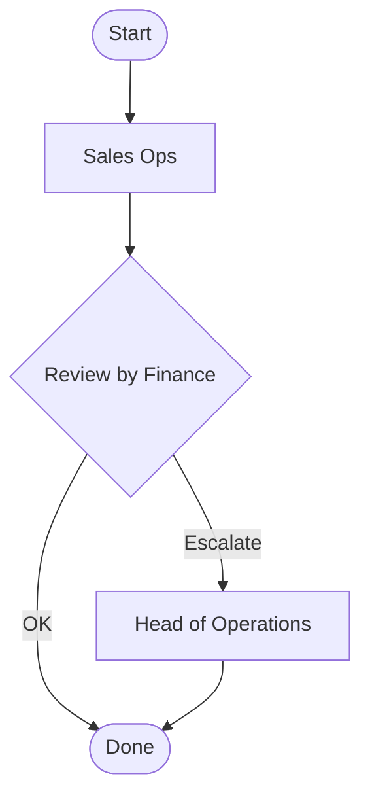
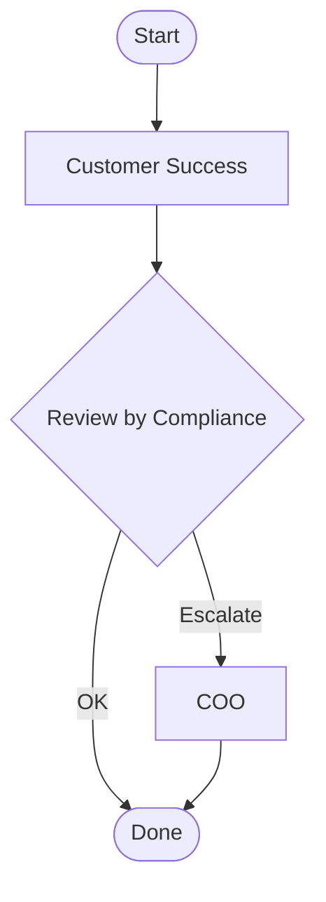

# Template Diagram

Templated diagram include in compact one-line form:

```mermaid
flowchart TD
start([Start]) --> owner["Risk Ops"]
owner --> review{"Review by Legal"}
review -->|OK| done([Done])
review -->|Escalate| escalator["Head of Operations"]
escalator --> done
```

Templated diagram include in multiline form:

```mermaid
flowchart TD
start([Start]) --> owner["Sales Ops"]
owner --> review{"Review by Finance"}
review -->|OK| done([Done])
review -->|Escalate| escalator["Head of Operations"]
escalator --> done
```

Templated diagram include via explicit path with arguments:

```mermaid
flowchart TD
start([Start]) --> owner["Customer Success"]
owner --> review{"Review by Compliance"}
review -->|OK| done([Done])
review -->|Escalate| escalator["COO"]
escalator --> done
```
