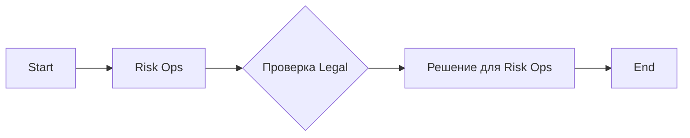
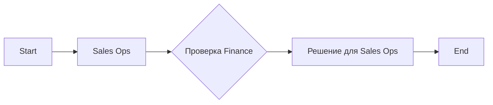

# Template Fragment

Шаблонный fragment include в compact one-line форме:

```mermaid
flowchart LR
Start --> risk__entry
risk__entry["Risk Ops"]
risk__entry --> risk__review{"Проверка Legal"}
risk__review --> risk__done["Решение для Risk Ops"]
risk__done --> End
```

Шаблонный fragment include по explicit path и multiline args:

```mermaid
flowchart LR
Start --> ops__entry
ops__entry["Sales Ops"]
ops__entry --> ops__review{"Проверка Finance"}
ops__review --> ops__done["Решение для Sales Ops"]
ops__done --> End
```
