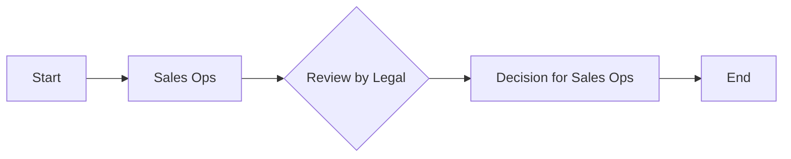

# Template Nested

Nested include with short `fragmentRef`:

```mermaid
flowchart LR
Start --> lane__entry
lane__entry["Audit Sales Ops: Legal"]
lane__entry --> lane__done["Close"]
lane__done --> End
```

Nested include with another short `fragmentRef`:

```mermaid
flowchart LR
Start --> lane__entry
lane__entry["Sales Ops"]
lane__entry --> lane__review{"Review by Legal"}
lane__review --> lane__done["Decision for Sales Ops"]
lane__done --> End
```

Nested include with explicit path `fragmentRef`:

```mermaid
flowchart LR
Start --> lane__entry
lane__entry["Audit Risk Ops: Legal"]
lane__entry --> lane__done["Close"]
lane__done --> End
```
