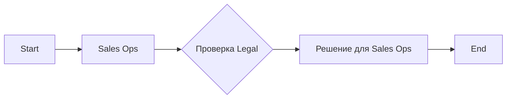

# Template Nested

Nested include с short `fragmentRef`:

```mermaid
flowchart LR
Start --> lane__entry
lane__entry["Аудит Sales Ops: Legal"]
lane__entry --> lane__done["Закрыть"]
lane__done --> End
```

Nested include с другим short `fragmentRef`:

```mermaid
flowchart LR
Start --> lane__entry
lane__entry["Sales Ops"]
lane__entry --> lane__review{"Проверка Legal"}
lane__review --> lane__done["Решение для Sales Ops"]
lane__done --> End
```

Nested include с explicit path `fragmentRef`:

```mermaid
flowchart LR
Start --> lane__entry
lane__entry["Аудит Risk Ops: Legal"]
lane__entry --> lane__done["Закрыть"]
lane__done --> End
```
