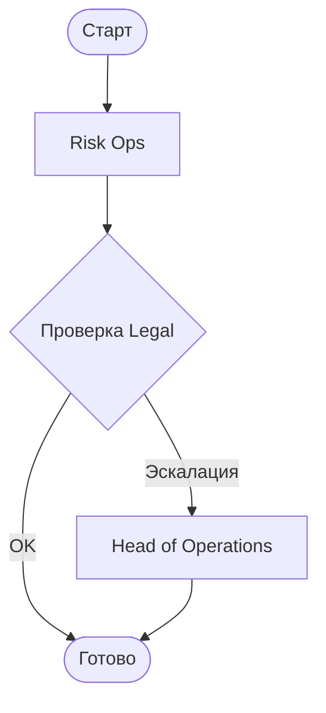
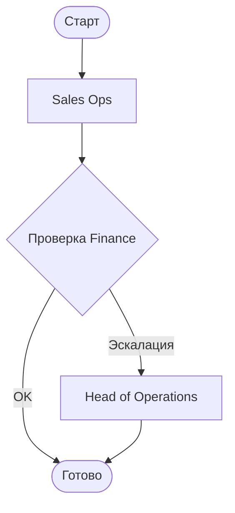
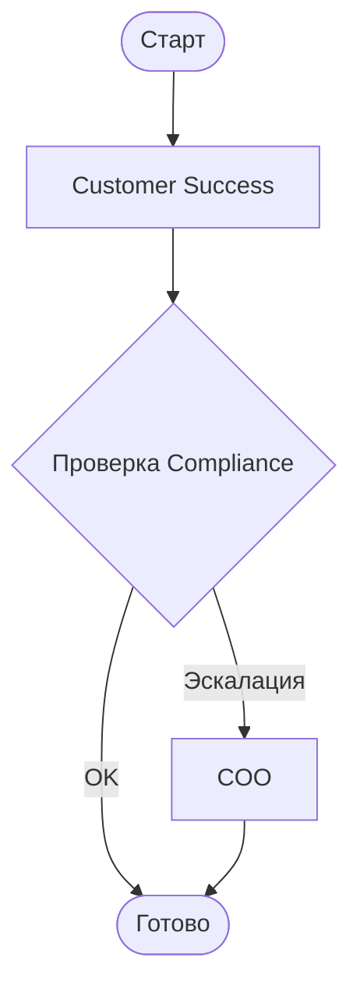

# Template Whole

Шаблонный whole include в compact one-line форме:

```mermaid
flowchart TD
start([Старт]) --> owner["Risk Ops"]
owner --> review{"Проверка Legal"}
review -->|OK| done([Готово])
review -->|Эскалация| escalator["Head of Operations"]
escalator --> done
```

Шаблонный whole include в multiline форме:

```mermaid
flowchart TD
start([Старт]) --> owner["Sales Ops"]
owner --> review{"Проверка Finance"}
review -->|OK| done([Готово])
review -->|Эскалация| escalator["Head of Operations"]
escalator --> done
```

Шаблонный whole include по explicit path с аргументами:

```mermaid
flowchart TD
start([Старт]) --> owner["Customer Success"]
owner --> review{"Проверка Compliance"}
review -->|OK| done([Готово])
review -->|Эскалация| escalator["COO"]
escalator --> done
```
