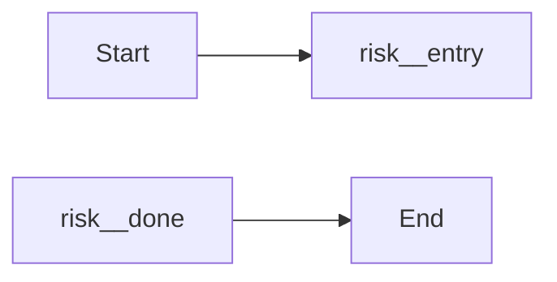
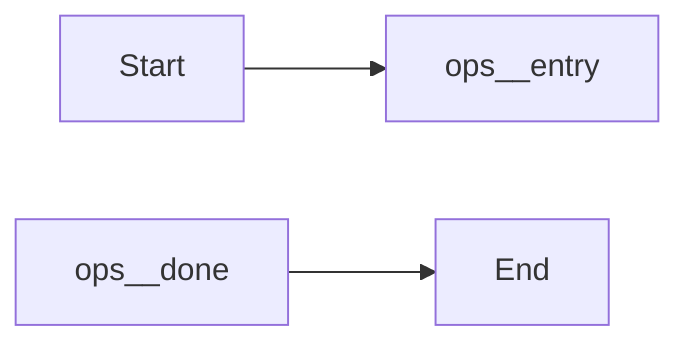

# Template Fragment

Templated fragment include in compact one-line form:

```mermaid
flowchart LR
Start --> risk__entry
%% include: template.verification-fragment as risk owner="Risk Ops" reviewer=Legal
risk__done --> End
```

Templated fragment include via explicit path with multiline args:

```mermaid
flowchart LR
Start --> ops__entry
%% include: ../shared/customer-templates.md#template.verification-fragment as ops
%% owner = Sales Ops
%% reviewer = Finance
ops__done --> End
```
