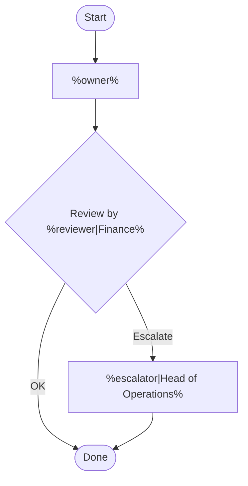
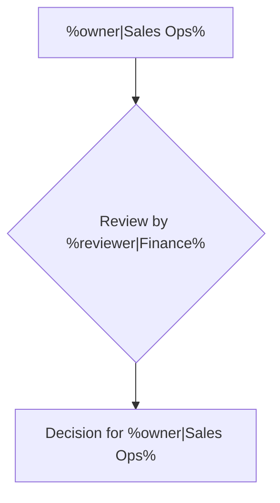
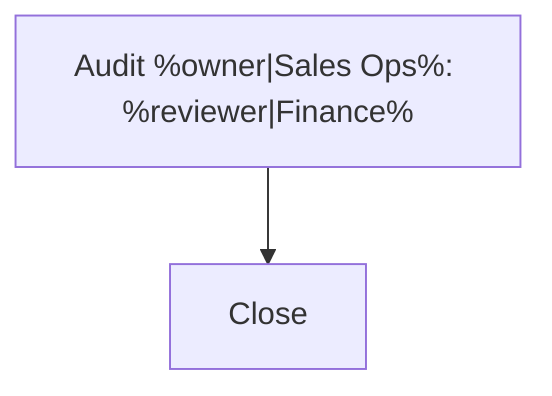
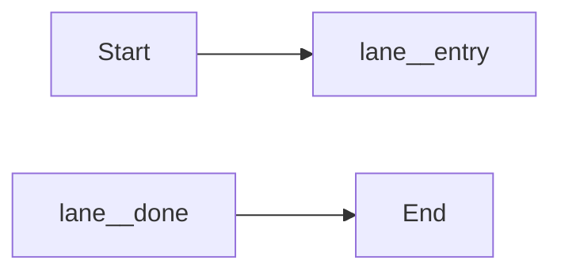

# Mermaid Template Library

<!-- mermaid:block template.customer-overview -->

<!-- /mermaid:block -->

<!-- mermaid:fragment template-verification exports=entry,done -->

<!-- /mermaid:fragment -->

<!-- mermaid:fragment template-audit exports=entry,done -->

<!-- /mermaid:fragment -->

<!-- mermaid:block template.wrapper -->

<!-- /mermaid:block -->
