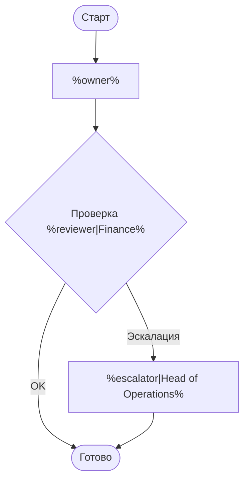
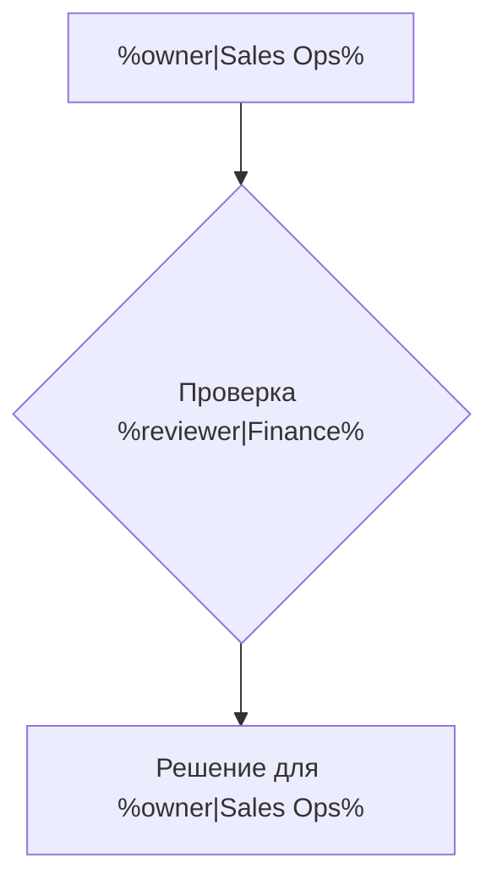
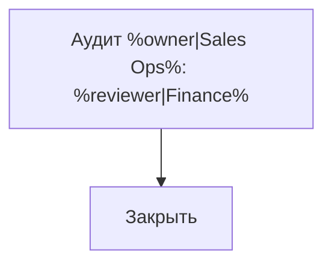
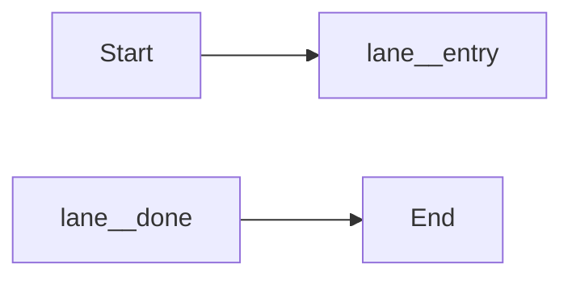

# Шаблонная библиотека Mermaid

<!-- mermaid:block template.customer-overview -->

<!-- /mermaid:block -->

<!-- mermaid:block template.verification-fragment type=fragment exports=entry,done -->

<!-- /mermaid:block -->

<!-- mermaid:block template.audit-fragment type=fragment exports=entry,done -->

<!-- /mermaid:block -->

<!-- mermaid:block template.wrapper -->

<!-- /mermaid:block -->
