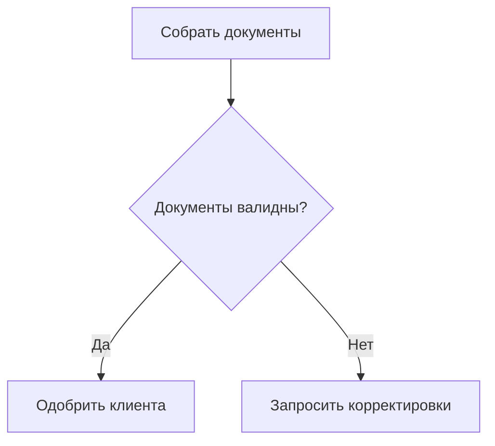
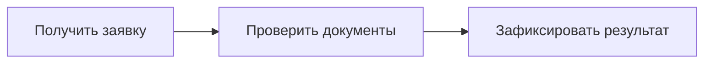

# Общая библиотека диаграмм

<!-- mermaid:block customer-verification.overview -->

```mermaid
flowchart TD
A[Собрать документы] --> B{Документы валидны?}
B -- Да --> C[Одобрить клиента]
B -- Нет --> D[Запросить корректировки]
```
<!-- /mermaid:block -->

<!-- mermaid:block customer-verification.short -->

```mermaid
flowchart LR
Start[Получить заявку] --> Review[Проверить документы]
Review --> Done[Зафиксировать результат]
```
<!-- /mermaid:block -->

