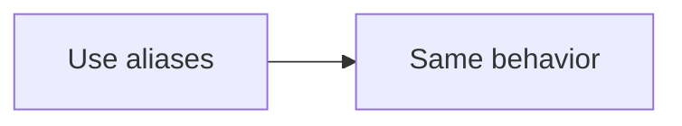

# Shared Markdown Sections

<!-- markdown:block customer-verification.section -->
## Customer Verification

This shared section stays in regular Markdown and can still embed a reusable Mermaid diagram.

```mermaid-include
customer-verification.short
```
<!-- /markdown:block -->

<!-- md:block customer-verification.alias-section -->
### Alias-Backed Section

This shared section uses the short declaration and include aliases internally.

```mm-include
customer-verification.alias-diagram
```
<!-- /md:block -->

<!-- mm:block customer-verification.alias-diagram -->

<!-- /mm:block -->
