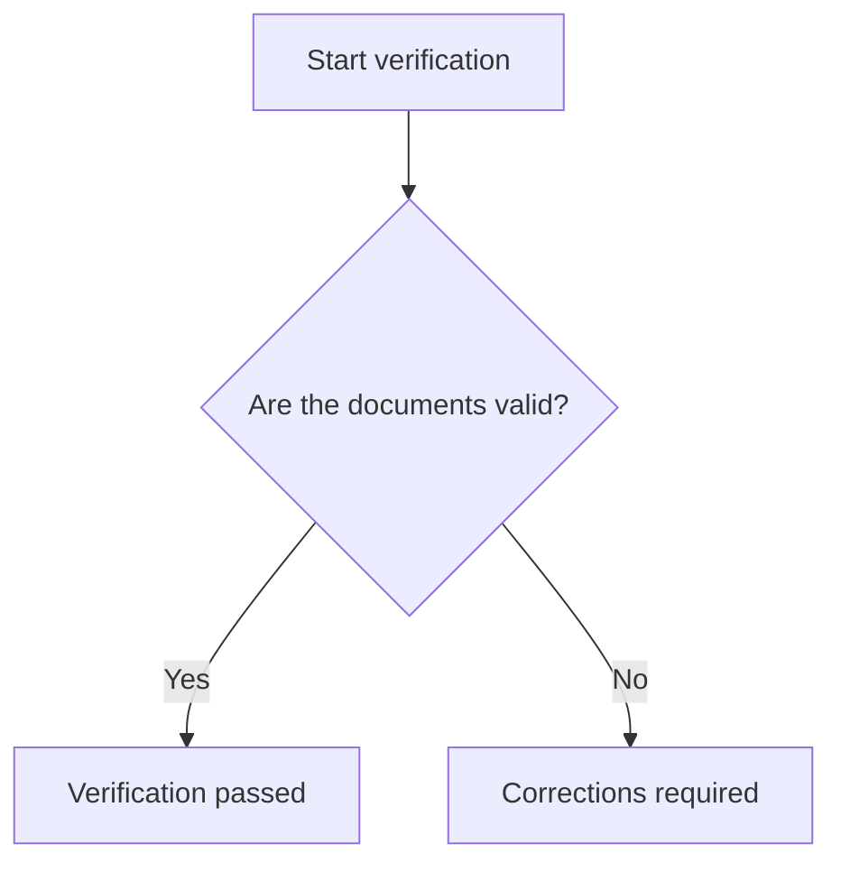

# Verification Fragment
<!-- mermaid:block verification-fragment.fragment type=fragment exports=entry,success,fail -->

```mermaid
flowchart TD
entry[Start verification]
entry --> check{Are the documents valid?}
check -- Yes --> success[Verification passed]
check -- No --> fail[Corrections required]
```
<!-- /mermaid:block -->
